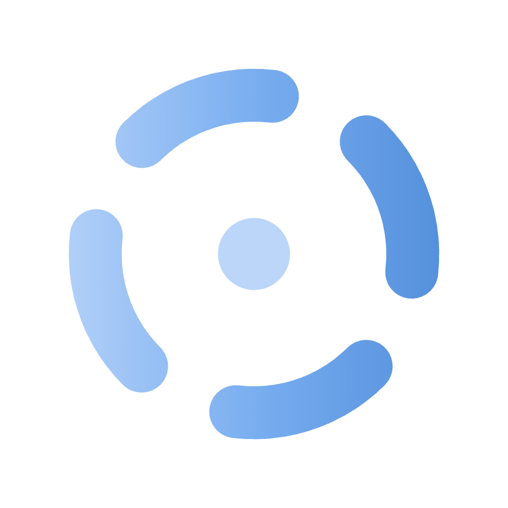

<div align="center">



# DStudio

**A native, local-first desktop app for DeepSeek V4 — chat, a coding agent and a design studio, all running on your Mac. Nothing leaves the device.**


</div>

DStudio is a single-file UI driven by a small C launcher that supervises [ds4](https://github.com/antirez/ds4), antirez's local inference engine for DeepSeek V4. On macOS it ships as **DStudio.app** — double-click from the Finder, no Terminal. The whole interface is one `index.html` (vanilla HTML/CSS/JS, no framework, no build step, no dependencies) embedded in the binary, so the app is fully self-contained, offline, and private.

**Why?**

- **Private & offline** — your chats, code and designs never leave the machine. No cloud, no telemetry, no subscription.
- **Three tools, one window** — a chat, a coding agent that edits files and runs commands, and a real design studio — on the *same* local model.
- **One binary** — a vanilla page embedded in a small C launcher; nothing to install but the app itself.
- **Use it from your phone** — flip a switch and reach the same chats from any device on your Wi-Fi, while the engine stays on your Mac.

## Modes

A sidebar switches between the three modes, each with its own history of reopenable conversations grouped by day.

### 💬 Chat

<div align="center">


</div>

Streaming chat backed by the server KV cache: the context lives server-side (prefix reuse, shown as *cached* tokens) and every message is saved locally. Live tokens/s, a collapsible reasoning block, LaTeX rendered to **native MathML** (no library), syntax-highlighted code — all offline and XSS-safe.

### 🤖 Agent


`ds4-agent` as a coding agent: it reads and edits files and runs commands in a working directory you choose. The transcript renders cleanly — folded tool calls, folded reasoning, a live plan — and a build-time post-edit check lets the model fix its own syntax errors in the same turn.

## 🎨 Design — a studio built **on** ds4

Design isn't a chat — it's a separate agent that runs a designer's pipeline end to end. **`ds4-design` is our own extension to ds4**: it lives in *this* repo (`extension/design/ds4_design.c`), built on the same DeepSeek V4 engine but with its own system prompt, tools and staged flow, and compiled into the ds4 repo automatically the first time you open Design. Because it's our code, it emits the structured events **natively** — no patch needed, unlike the agent.

The whole pipeline, from a one-line idea to laid-out screens:

**1 · Brief** — a structured interview instead of a blank prompt: it asks what you're making, the platform, the tone, the brand direction and the scale, so it aims in the right direction from the start.


**2 · Generating** — it writes a short plan, then builds the screens, showing live progress. Tool noise stays out of the conversation.


**3 · Proposal** — several **distinct directions** to compare side by side, each with a name and a rationale; pick one to refine or use.


**4 · Canvas** — every screen on an infinite canvas (pan/zoom, fit-to-view, artboard chrome). Refine the selected screen by describing the next change, then export the whole project as a zip.


## 🏗️ Build — from a chat goal to a runnable web app

Toggle **Build** on in Agent mode and a one-line idea becomes a **real, runnable Django web app** — built page by page, entirely on your machine. A **deterministic driver** (not the model) walks the plan and decides *done* from the **filesystem**, never from the model's say-so, so it holds up even on a weak local quant.

<div align="center">


</div>

> 🎥 **[Watch it build an app end to end](https://www.youtube.com/watch?v=kLuf9JDTAxM)** — the finished result is at **3:28**.

**1 · It interviews you.** Instead of guessing, it asks one question at a time — scope, the must-have pages, auth, the data, the visual style — each as a clickable card (pick an option or write your own).

**2 · It proposes a plan.** Once it has enough, it lays out the pages plus a one-line style direction. Nothing is written until you approve it.

**3 · It builds page by page, switching agents.** For each page the driver **switches engines**: the **design agent** makes the page's look (style-locked to the first approved page), then the **coding agent** wires that exact page into Django — models, views, urls, forms, templates. You're in the loop once: approve the first page's look, which locks the design tokens for the rest.

**4 · Queue follow-ups while it builds.** Type while it works — your message doesn't interrupt the current page; it's queued and applied after the page is done, and if it's ambiguous the agent asks a quick clarifying question first.

A live console shows the pages stack (done ✓ / now / to do), what it's doing right now, the skills/craft packs it pulled on demand, and colored **+/- diffs** for every file edit.

## Highlights

- **Local-first & private.** Everything runs on your Mac. No telemetry, no cloud, strict CSP — the app speaks only to your engine.
- **Self-contained app.** The entire UI is one vanilla file, base64-embedded in the binary. No asset files, no CDN, no build step.
- **Non-invasive integration.** The agent's structured output comes from a small, **reversible, build-time patch** of the engine source: DStudio backs it up, builds a separately-named binary, and restores the original immediately — the ds4 repo stays pristine, and if the patch ever fails it falls back to the stock agent.
- **Pick model & reasoning per chat.** A gear in the composer collapses the model variant (Flash / Pro), the reasoning level (off / normal / max) and the working folder into one popover, in every mode.
- **Zero-config networking.** Localhost by default; one toggle exposes it on your Wi-Fi — and the engine still never leaves localhost (see below).

## Requirements

This is a heavy local setup — be honest with yourself about the hardware:

- **OS.** One `make` builds the branded app per platform: **DStudio.app** on **macOS** (Apple Silicon — the primary, tested target; double-click, no Terminal) and a **`dstudio`** binary on **Linux** (WebKitGTK / GTK3 via `webkit2gtk-4.1`, same logo). Linux is less exercised, and `ds4` itself must be built for your platform (the reference engine integration targets Apple **Metal**).
- A C compiler (`cc` / `clang`). `node` is optional, only for `make check`.
- **[antirez's ds4](https://github.com/antirez/ds4)** — clone it and build it in a **sibling folder** of DStudio (`git clone https://github.com/antirez/ds4`, default `../ds4`, also resolved at `~/Documents/dev/ds4`), so the `ds4-server` / `ds4-agent` binaries exist. The rich agent mode targets antirez's **original** ds4 source; on a **fork**, switch **Agent output → Raw** in Settings (see *The agent patch* under [How it works](#how-it-works)).
- **A DeepSeek V4 GGUF model.** Two variants (IQ2_XXS, 2-bit):
  - **Flash** — ~87 GB on disk, ~96–128 GB RAM
  - **Pro** — ~430 GB on disk, ~512 GB RAM

  Missing the weights? The first-run onboarding can download a variant for you and shows the size before it pulls.

> Not packing a 96 GB Mac? The screenshots above show every mode in action — chat, the coding agent, the design pipeline and LAN access.

`ds4-design` lives in **this** repo (`extension/design/ds4_design.c`) and is compiled into the ds4 repo automatically the first time you open Design.

## Quick start

```sh
make            # macOS: builds DStudio.app · Linux: builds ./dstudio
make run        # build + start on http://127.0.0.1:5500
make check      # sanity: page stays text, JS syntax OK
```

Launch **DStudio.app** on macOS (or run `./dstudio` on Linux, or open `http://127.0.0.1:5500`). The first-run onboarding walks you through the engine status, the folder paths (editable and verified live), the model, and the context size.

Optional parameters:

```sh
make run PORT=8080 DS4_DIR=/path/to/ds4
# or directly:
./dstudio [web_port] [ds4_dir]
```

Dev loop: `DS4UI_PAGE_FROM_DISK=1 ./dstudio` serves `web/index.html` from disk (hot editing) instead of the embedded copy. `DS4UI_NO_WINDOW=1` runs headless (server only).

## Network (LAN)

DStudio is **localhost-only by default**. To use it from another device on the same Wi-Fi — your phone, a tablet, another Mac — flip one switch in **Settings → Network access → Enable on the LAN**. The app shows the exact address to open, e.g. `http://192.168.1.207:5500`.

<div align="center">
  
  &nbsp;&nbsp;&nbsp;
  
</div>

<p align="center"><sub>One toggle in Settings (left) → open the address on your phone (right). The model streams over the network — no app to install on the device.</sub></p>

Behind the scenes DStudio **reverse-proxies the engine API** (`/v1`) to the local engine, so the engine itself never leaves `127.0.0.1`: a LAN client only ever talks to DStudio, and there's **nothing to configure**.

> ⚠️ With the LAN enabled, anyone on the network can use the chat **and** the agent, which runs commands and edits files on this machine. Use trusted networks only, and turn it off when you're done.

## How it works

- **C launcher, not a script.** `dstudio.c` is an HTTP server *and* the engine supervisor: it starts/stops `ds4-server` (chat), `ds4-agent` (coding) and `ds4-design`, manages the working directory, and exposes a small local API. It replaces `start.sh`.
- **Native window.** `app.cc` forks the server and opens a WKWebView (macOS) / WebKitGTK (Linux) window via `webview.h`; the page is base64-embedded (`page_data.h`).
- **Same-origin proxy.** The page calls DStudio for `/v1`; DStudio forwards (streaming) to the local engine — which is why LAN works with no engine exposure and no settings.

### The agent patch — building on ds4 without forking

ds4's agent is a separate, fast-moving codebase that can't be modified permanently. To get **structured output** — clean tool calls, folded reasoning, and KV-session slash-commands over the pipe — without forking it, DStudio applies a small, **additive and fully reversible** patch at build time:

1. it backs up `ds4_agent.c`,
2. applies anchored edits (a gated `--jsonl` flag + event emitters),
3. builds a **separately-named** binary (`ds4-agent-jsonl`), reusing the existing object files,
4. **restores the original source immediately.**

The canonical `ds4-agent` and its source are never touched; the build is idempotent (a version stamp forces a rebuild only when the patch itself changes), and it self-heals on the next launch even after a crash. If the patch ever fails to apply — e.g. the upstream code was reworked — DStudio **falls back to the stock `ds4-agent`** and the UI parses its raw output instead. The ds4 repo always stays pristine. (`ds4-design` is *our* code, in this repo, so it emits these events natively — no patch.)

#### ⚠️ The patch targets antirez's **original** ds4 — forks must disable it

The structured (patched) mode works against the **unmodified upstream [ds4](https://github.com/antirez/ds4)**: the patch finds its insertion points by **exact source anchors** in `ds4_agent.c`. On the original repo those anchors match and you get the full experience.

If you run a **fork of ds4** that changes the agent source, the anchors may no longer line up. The patch then refuses to apply (and DStudio auto-falls-back to the stock agent), but to skip the failing attempt entirely, **disable the patch**:

> **Settings → Agent output → Raw.** This runs the stock `ds4-agent` untouched and the UI parses its plain text — lower fidelity, but it works on any ds4. (The choice is persisted, so set it once.)

<div align="center">
  
</div>

**Why it's done this way.** ds4 is antirez's project — fast-moving, and not the kind of repo that takes a UI's structured-output hooks upstream. So instead of forking it (which would mean maintaining a divergent copy forever) or shipping a modified binary, the integration stays **non-invasive and reversible**: it patches by anchor, builds a separate binary, and restores the source immediately. The trade-off is deliberate — the rich mode is bound to the *specific* source it was written against, and the **Raw fallback is what keeps the app working on anything else** (a fork, or a future upstream that moved the anchors). You keep the engine pristine; you opt into fidelity only where the source matches.

### KV cache — how context is kept

DeepSeek V4 keeps the conversation in ds4-server's **KV cache** instead of re-encoding it from scratch every turn:

- **Chat** re-sends its history behind a **stable prefix**, so the server reuses the cached prefix automatically — shown as the blue *cached* token count under each reply. The KV cache is also written **to disk**, so context survives engine restarts.
- **Agent & design** each get a **named KV session per conversation** (`<sha>.kv`), autosaved every turn. Reopening a conversation restores its exact engine state with `/switch` — so every agent/design thread has its **own independent memory** and you can jump between them without losing context.

## Security

- **Localhost by default** (`DS4UI_HOST` overrides the boot host); the page is served from a fixed path — no client path ever touches the filesystem.
- Engine spawned with `fork`+`execv` (argument array, **no shell**): no command injection. Model from a fixed enum, integer parameters range-checked, working dir passed as a single argument.
- Mutating local APIs require the anti-CSRF header `X-Requested-With: ds4web`.

> ⚠️ In **agent** mode the model runs commands and edits files **autonomously** inside the chosen working directory — that directory is the security boundary, so point it at a project folder.

## Roadmap

Where DStudio is headed (ideas, not promises):

- **Sharper Design studio** — *in progress* — push `ds4-design` further: higher-fidelity screens, more distinct directions, and faster refine loops on the canvas.
- **Cowork** — *planned* — collaborative sessions: share a workspace and build alongside the model, together.
- **MCP** — *planned* — Model Context Protocol support, so the agent can plug into external tools and data sources beyond the working directory.

## Contributing

It's an early, fast-moving project for the local-AI crowd. If you find it interesting, a ⭐ helps it find the people who'd enjoy it. Issues and PRs welcome — the whole UI is one readable vanilla file.

## License

[BSD 3-Clause](LICENSE) © 2026 Giuseppe Perrotta
