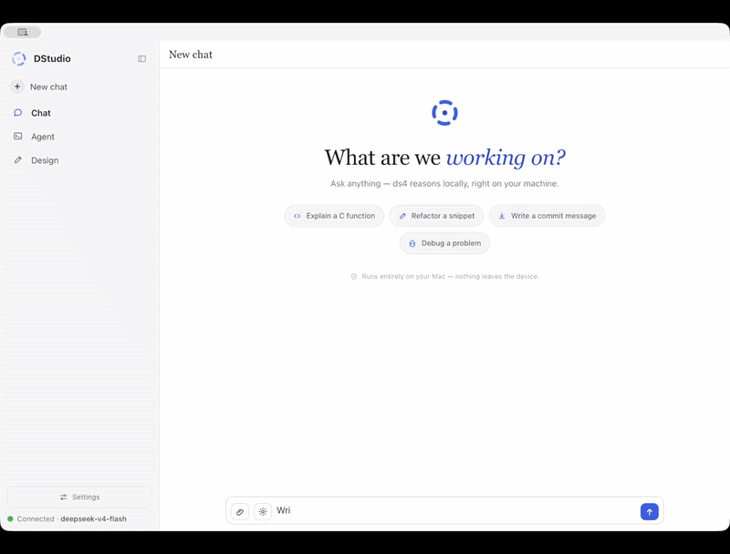
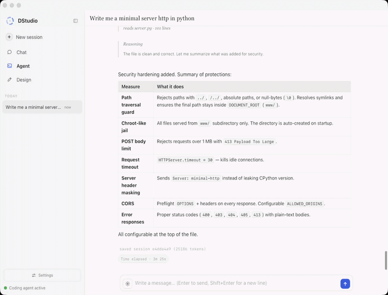

<div align="center">


# DStudio — Local AI Studio for DeepSeek V4

**An open-source local AI studio for DeepSeek V4 and ds4: private chat, a local coding agent, a design agent, Web Search and Plan mode for Markdown planning files. Runs on your machine. No cloud required.**


</div>

DStudio turns [ds4](https://github.com/antirez/ds4), antirez's local DeepSeek V4 inference engine, into a full desktop AI workspace: a private AI chat, a local coding agent, a design studio and a planning workspace in one native UI. It is built for people who want a **local-first Cursor/Lovable-style workflow** without sending code, prompts or design work to a remote API.

In plain terms: DStudio is a **ds4 GUI**, a **local DeepSeek V4 desktop app**, a **private coding agent** and a **local AI design/planning studio** packaged as one open-source project.

On macOS it ships as **DStudio.app**: double-click from Finder, no Terminal. On Windows it ships as a portable folder with `DStudio.exe` and the DS4 runtime binaries. The UI is a single vanilla `index.html` embedded in a small C launcher, so there is no Electron bundle, no framework build step, no CDN and no telemetry.

## 30-second start

```sh
make
open DStudio.app        # macOS
# or: ./dstudio         # Linux/headless workflows
```

Windows users should use the portable zip and run `DStudio.exe`.

On first launch, DStudio runs a local system check for the engine folder, model,
chat engine, agent, design runtime and Web Search. Missing pieces show a direct
button such as **Choose**, **Download**, **Start** or **Settings**.

## What You Can Do

- Run **DeepSeek V4 locally** through a native macOS/Linux desktop interface.
- Use a **private AI chat** with persistent KV cache, reasoning display, citations from optional Web Search and local history.
- Use a **local coding agent** that reads, edits and verifies files inside a folder you choose.
- Generate interface concepts with **ds4-design**, a design agent built on ds4.
- Keep the engine private while still reaching the UI from another device on your LAN.

## Modes

A sidebar switches between Chat, Agent and Design. Each mode has its own reopenable conversation history, and each agent/design session keeps its own local KV state.

### 💬 Chat

<div align="center">



</div>

Streaming DeepSeek V4 chat backed by the ds4 server KV cache: the context lives server-side (prefix reuse, shown as *cached* tokens) and every message is saved locally. You get live tokens/s, collapsible reasoning, native MathML for LaTeX, syntax-highlighted code and optional Web Search sources through the local browser.

### 🤖 Agent

<div align="center">



</div>

`ds4-agent` becomes a local coding agent: it reads and edits files, runs commands in a working directory you choose, renders folded tool calls/reasoning, and keeps a live plan. A post-edit verifier catches common syntax errors immediately, so the model can fix broken code in the same turn.

## 🎨 Design — a studio built **on** ds4

Design is not a chat skin. It is a separate local design agent that runs a designer's pipeline end to end. **`ds4-design` is DStudio's own extension to ds4**: it lives in this repo (`extension/design/ds4_design.c`), uses the same DeepSeek V4 engine, and has its own system prompt, tools, staged flow and native structured events.

The whole pipeline, from a one-line idea to laid-out screens:

**1 · Brief** — a structured interview instead of a blank prompt: it asks what you're making, the platform, the tone, the brand direction and the scale, so it aims in the right direction from the start.


**2 · Generating** — it writes a short plan, then builds the screens, showing live progress. Tool noise stays out of the conversation.


**3 · Proposal** — several **distinct directions** to compare side by side, each with a name and a rationale; pick one to refine or use.


**4 · Canvas** — every screen on an infinite canvas (pan/zoom, fit-to-view, artboard chrome). Refine the selected screen by describing the next change, then export the whole project as a zip.


## 📝 Plan — from a rough goal to a Markdown execution plan

Toggle **Plan** in Agent mode, describe what you want, and DStudio writes a **Markdown planning file** into the selected workspace. It is intentionally planning-only: no scaffolding, no Design handoff, no hidden app builder. The agent turns the request into a concrete `plan.md` or `<topic>-plan.md` with assumptions, milestones, tasks, risks and validation steps.

<div align="center">


</div>

**1 · You describe the outcome.** Give it a product idea, feature, workflow, migration, research task or implementation goal.

**2 · It plans instead of building.** The agent makes reasonable assumptions, scopes the work and writes a Markdown file in your workspace.

**3 · The file is useful immediately.** The plan includes objective, assumptions, deliverables, milestones, task breakdown, technical/design decisions, risks, validation checklist and next actions.

**4 · Then you decide.** Turn Plan off and use Agent/Design to implement, or keep the Markdown file as a handoff document.

## Highlights

- **Local-first & private.** Everything runs on your machine. No telemetry, no cloud backend, strict CSP — the app speaks only to your local engine.
- **Self-contained native app.** The UI is one vanilla file base64-embedded in the binary. No Electron, no asset server, no CDN.
- **Non-invasive integration.** The agent's structured output comes from a small, **reversible, build-time patch** of the engine source: DStudio backs it up, builds a separately-named binary, and restores the original immediately — the ds4 repo stays pristine, and if the patch ever fails it falls back to the stock agent.
- **Setup doctor.** First run checks the ds4 folder, GGUF model, chat engine, agent, design runtime, Web Search, port and LAN state, then gives a direct fix button.
- **Pick model & reasoning per chat.** A gear in the composer collapses model selection, reasoning level, Web Search and working folder into one popover.
- **Zero-config networking.** Localhost by default; one toggle exposes it on your Wi-Fi — and the engine still never leaves localhost (see below).

## Who It's For

DStudio is for local-AI builders who have the hardware to run DeepSeek V4 and want an open-source desktop workflow for private AI coding, local design generation and no-cloud app building. It is intentionally heavy: if you do not have enough RAM for the GGUF, use the screenshots and demo as the preview until your hardware catches up.

## Requirements

This is a serious local AI setup. DStudio removes product friction, not physics:

- **OS.** One `make` builds the branded app per platform: **DStudio.app** on **macOS** (Apple Silicon is the primary tested target), a **`dstudio`** binary on **Linux** (WebKitGTK / GTK3 via `webkit2gtk-4.1`) and a portable **Windows x64** folder/zip via `make windows`. Linux and Windows are less exercised, and `ds4` itself must be built for your platform.
- A C compiler (`cc` / `clang`). `node` is optional, only for `make check`.
- **[antirez's ds4](https://github.com/antirez/ds4)** — clone it and build it in a **sibling folder** of DStudio (`git clone https://github.com/antirez/ds4`, default `../ds4`, also resolved at `~/Documents/dev/ds4`), so the `ds4-server` / `ds4-agent` binaries exist. The rich agent mode targets antirez's **original** ds4 source; on a **fork**, switch **Agent output → Raw** in Settings (see *The agent patch* under [How it works](#how-it-works)).
- **A DeepSeek V4 GGUF model.** Two variants (IQ2_XXS, 2-bit):
  - **Flash** — ~87 GB on disk, ~96–128 GB RAM
  - **Pro** — ~430 GB on disk, ~512 GB RAM

  Missing the weights? The first-run setup can download a variant and shows the size before it pulls.

> Not packing a 96 GB Mac? The screenshots above show every mode in action — chat, the coding agent, the design pipeline and LAN access.

`ds4-design` lives in **this** repo (`extension/design/ds4_design.c`) and is compiled into the ds4 repo automatically the first time you open Design.

### Windows notes

For normal use, download/extract the Windows portable zip and run `DStudio.exe`. Keep the files together: `DStudio.exe`, `ds4-server.exe`, `ds4-agent.exe`, `ds4-agent-jsonl.exe`, `ds4-agent-jsonl.ver` and `ds4-design.exe` are meant to live in the same portable folder.

If you build DStudio or use Agent/Design from a LAN client with your own local DS4 checkout, install:

- **Microsoft Edge WebView2 Runtime** if your Windows install does not already have it.
- **MSYS2 POSIX** build tools: `pacman -S --needed make git patch gcc`.
- **Visual Studio Build Tools** or `clang-cl` for building the native Windows wrapper.

The error `msys-gcc_s-seh-1.dll was not found` means Windows found `ds4-agent-jsonl.exe` but not the MSYS2 runtime it was built with. Install MSYS2 in `C:\msys64`; DStudio adds its runtime directories to `PATH` before launching Agent/Design. Do not copy `msys-2.0.dll` or Cygwin/MSYS DLLs next to the DS4 binaries: that can make MSYS detect the wrong root and break `/tmp`, `fork()` and shell tools. LAN Agent/Design model calls use DStudio's internal bridge, and Agent bash tools are launched through the Windows process API, so `curl.exe` is no longer required.

## Quick start

```sh
make            # macOS: builds DStudio.app · Linux: builds ./dstudio
make run        # build + start on http://127.0.0.1:5500
make check      # sanity: page stays text, JS syntax OK
```

Launch **DStudio.app** on macOS, run `./dstudio` on Linux, or open `http://127.0.0.1:5500`. The first-run setup walks through engine status, ds4 folder, model file, context size and the System Check panel.

Optional parameters:

```sh
make run PORT=8080 DS4_DIR=/path/to/ds4
# or directly:
./dstudio [web_port] [ds4_dir]
```

Dev loop: `DS4UI_PAGE_FROM_DISK=1 ./dstudio` serves `web/index.html` from disk (hot editing) instead of the embedded copy. `DS4UI_NO_WINDOW=1` runs headless (server only).

## Network (LAN)

DStudio is **localhost-only by default**. To use it from another device on the same Wi-Fi — your phone, a tablet, another Mac — flip one switch in **Settings → Network access → Enable on the LAN**. The app shows the exact address to open, e.g. `http://192.168.1.207:5500`.

<div align="center">
  
  &nbsp;&nbsp;&nbsp;
  
</div>

<p align="center"><sub>One toggle in Settings (left) → open the address on your phone (right). The model streams over the network — no app to install on the device.</sub></p>

Behind the scenes DStudio **reverse-proxies the engine API** (`/v1`) to the local engine, so the engine itself never leaves `127.0.0.1`: a LAN client only ever talks to DStudio, and there's **nothing to configure**.

> ⚠️ With the LAN enabled, anyone on the network can use the chat **and** the agent, which runs commands and edits files on this machine. Use trusted networks only, and turn it off when you're done.

## How it works

- **C launcher, not a script.** `dstudio.c` is both the local HTTP server and the engine supervisor: it starts/stops `ds4-server` for chat, `ds4-agent` for coding and `ds4-design` for design, manages working directories, runs the setup doctor, proxies `/v1`, serves Web Search and exposes a small local API.
- **Native window.** `app.cc` forks the server and opens a WKWebView (macOS) / WebKitGTK (Linux) window via `webview.h`; the page is base64-embedded (`page_data.h`).
- **Same-origin proxy.** The page calls DStudio for `/v1`; DStudio forwards (streaming) to the local engine — which is why LAN works with no engine exposure and no settings.

### The agent patch — building on ds4 without forking

ds4's agent is a separate, fast-moving codebase that can't be modified permanently. To get **structured output** — clean tool calls, folded reasoning, and KV-session slash-commands over the pipe — without forking it, DStudio applies a small, **additive and fully reversible** patch at build time:

1. it backs up `ds4_agent.c`,
2. applies anchored edits (a gated `--jsonl` flag + event emitters),
3. builds a **separately-named** binary (`ds4-agent-jsonl`), reusing the existing object files,
4. **restores the original source immediately.**

The canonical `ds4-agent` and its source are never touched; the build is idempotent (a version stamp forces a rebuild only when the patch itself changes), and it self-heals on the next launch even after a crash. If the patch ever fails to apply — e.g. the upstream code was reworked — DStudio **falls back to the stock `ds4-agent`** and the UI parses its raw output instead. The ds4 repo always stays pristine. (`ds4-design` is *our* code, in this repo, so it emits these events natively — no patch.)

#### ⚠️ The patch targets antirez's **original** ds4 — forks must disable it

The structured (patched) mode works against the **unmodified upstream [ds4](https://github.com/antirez/ds4)**: the patch finds its insertion points by **exact source anchors** in `ds4_agent.c`. On the original repo those anchors match and you get the full experience.

If you run a **fork of ds4** that changes the agent source, the anchors may no longer line up. The patch then refuses to apply (and DStudio auto-falls-back to the stock agent), but to skip the failing attempt entirely, **disable the patch**:

> **Settings → Agent output → Raw.** This runs the stock `ds4-agent` untouched and the UI parses its plain text — lower fidelity, but it works on any ds4. (The choice is persisted, so set it once.)

<div align="center">
  
</div>

**Why it's done this way.** ds4 is antirez's project — fast-moving, and not the kind of repo that takes a UI's structured-output hooks upstream. So instead of forking it (which would mean maintaining a divergent copy forever) or shipping a modified binary, the integration stays **non-invasive and reversible**: it patches by anchor, builds a separate binary, and restores the source immediately. The trade-off is deliberate — the rich mode is bound to the *specific* source it was written against, and the **Raw fallback is what keeps the app working on anything else** (a fork, or a future upstream that moved the anchors). You keep the engine pristine; you opt into fidelity only where the source matches.

### KV cache — how context is kept

DeepSeek V4 keeps the conversation in ds4-server's **KV cache** instead of re-encoding it from scratch every turn:

- **Chat** re-sends its history behind a **stable prefix**, so the server reuses the cached prefix automatically — shown as the blue *cached* token count under each reply. The KV cache is also written **to disk**, so context survives engine restarts.
- **Agent & design** each get a **named KV session per conversation** (`<sha>.kv`), autosaved every turn. Reopening a conversation restores its exact engine state with `/switch` — so every agent/design thread has its **own independent memory** and you can jump between them without losing context.

## Security

- **Localhost by default** (`DS4UI_HOST` overrides the boot host); the page is served from a fixed path — no client path ever touches the filesystem.
- Engine spawned with `fork`+`execv` (argument array, **no shell**): no command injection. Model from a fixed enum, integer parameters range-checked, working dir passed as a single argument.
- Mutating local APIs require the anti-CSRF header `X-Requested-With: ds4web`.

> ⚠️ In **agent** mode the model runs commands and edits files **autonomously** inside the chosen working directory — that directory is the security boundary, so point it at a project folder.

## Roadmap

Where DStudio is headed (ideas, not promises):

- **Sharper Design studio** — higher-fidelity screens, more distinct directions and faster refine loops on the canvas.
- **Sharper Plan mode** — richer Markdown plans with better assumptions, acceptance criteria and handoff quality.
- **Cowork** — collaborative sessions: share a workspace and build alongside the local model.
- **MCP** — Model Context Protocol support so the agent can plug into external tools and data sources beyond the working directory.

## Contributing

DStudio is early, hardware-hungry and built for the local-AI crowd. The most useful contributions right now are setup reports, hardware reports, reproducible agent failures, design-output examples and small PRs that reduce first-run friction. If you want open-source local AI tools to exist outside cloud subscriptions, a ⭐ helps the project reach the right testers.

## License

[BSD 3-Clause](LICENSE) © 2026 Giuseppe Perrotta
