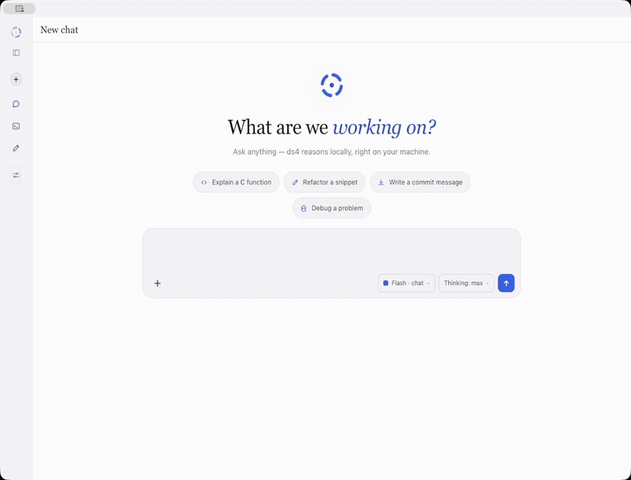
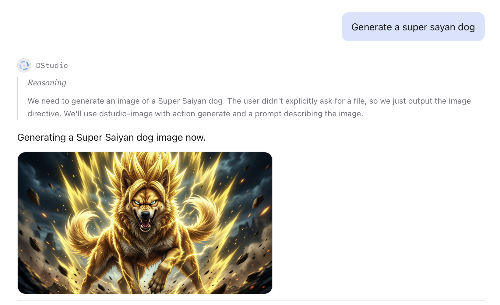
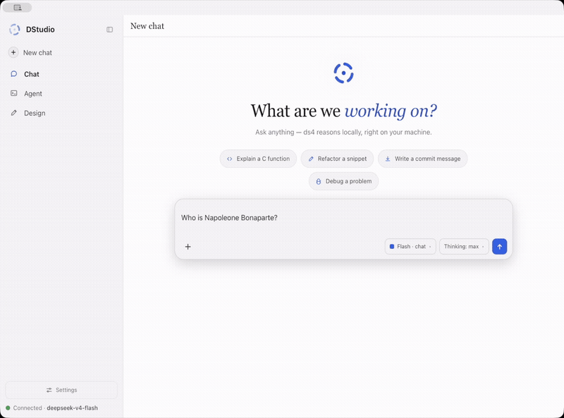
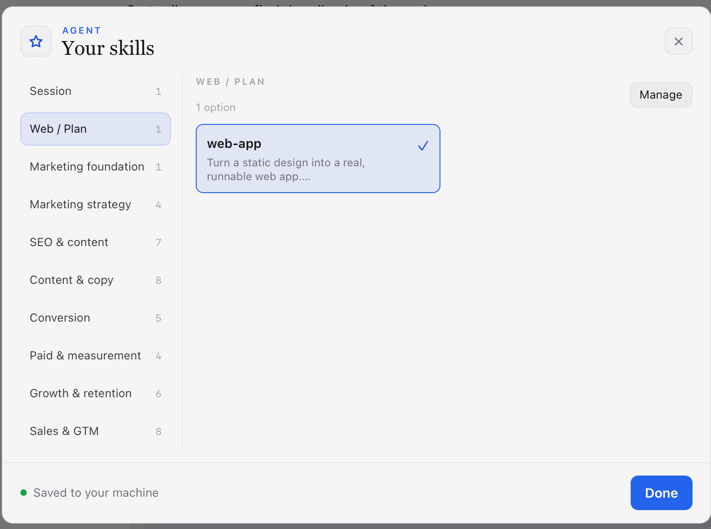
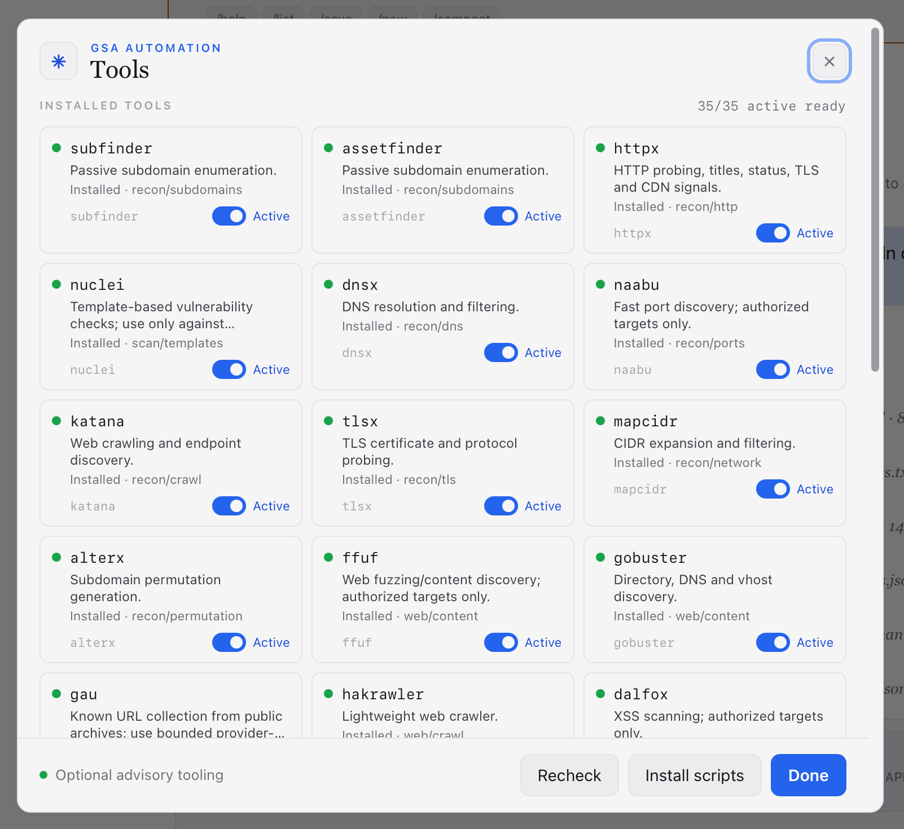

<div align="center">


# DStudio: Local AI Studio for DeepSeek V4

**An open-source local AI studio for DeepSeek V4 and ds4: private chat, a local coding agent, Skills, Guided Security Analysis, a design agent, Web Search, Deep Research and Plan mode for Markdown planning files. Runs on your machine. No cloud required.**


</div>

DStudio turns [ds4](https://github.com/antirez/ds4), antirez's local DeepSeek V4 inference engine, into a full desktop AI workspace: a private AI chat, a local coding agent, a design studio and a planning workspace in one native UI. It is built for people who want a **local-first Cursor/Lovable-style workflow** without sending code, prompts or design work to a remote API.

In plain terms: DStudio is a **ds4 GUI**, a **local DeepSeek V4 desktop app**, a **private coding agent** and a **local AI design/planning studio** packaged as one open-source project.

On macOS it ships as **DStudio.app**: double-click from Finder, no Terminal. On Windows it ships as a portable folder with `DStudio.exe` and the DS4 runtime binaries. The UI is a single vanilla `index.html` embedded in a small C launcher, so there is no Electron bundle, no framework build step, no CDN and no telemetry.

## 30-second start

```sh
make
open DStudio.app        # macOS
# or: ./dstudio         # Linux/headless workflows
```

Windows users should use the portable zip and run `DStudio.exe`.

On first launch, DStudio runs a local system check for the engine folder, model,
chat engine, agent, design runtime and Web Search. Missing pieces show a direct
button such as **Choose**, **Download**, **Start** or **Settings**.

## What You Can Do

- Run **DeepSeek V4 locally** through a native macOS/Linux desktop interface.
- Use a **private AI chat** with persistent KV cache, reasoning display, citations from optional Web Search and local history.
- Run **Web Search or Deep Research** through DStudio's local browser/search helper, with read-page evidence and source cards.
- Generate new images or edit an existing image through a dedicated local pipeline that keeps the source pixels on your machine.
- Use a **local coding agent** that reads, edits and verifies files inside a folder you choose.
- Browse and load **Skills**: focused local instructions for Agent, Design and imported cybersecurity workflows.
- Run **Guided Security Analysis (GSA)** for authorized local source reviews or target-scoped security work, using imported cybersecurity skills and optional local tools.
- Generate interface concepts with **ds4-design**, a design agent built on ds4.
- Keep the engine private while still reaching the UI from another device on your LAN.

## Modes

A sidebar switches between Chat, Agent and Design. Each mode has its own reopenable conversation history, and each agent/design session keeps its own local KV state.

### Chat

<div align="center">


</div>

Streaming DeepSeek V4 chat backed by the ds4 server KV cache: the context lives server-side (prefix reuse, shown as *cached* tokens) and every message is saved locally. You get live tokens/s, collapsible reasoning, native MathML for LaTeX, syntax-highlighted code and optional Web Search sources through the local browser.

## Multimodal PDFs

<div align="center">



</div>

Attach a PDF and ask naturally in any language. DeepSeek V4 decides whether to build a bounded whole-document overview, read an exact physical page or search semantically across every page. DStudio extracts the text locally, reads scans and meaningful figures when needed, caches a multilingual page index and sends only the strongest evidence back to DeepSeek for the final answer. This keeps the prompt bounded even for 1,000-page books while later searches reuse the local index.

## Local Image Generation

<div align="center">



</div>

Ask for an image naturally in any language. DeepSeek V4 understands the intent and emits a structured image instruction, so routing is based on the model's interpretation rather than a list of phrases or regular expressions. DStudio then hands the prompt to a dedicated local generator. A new-image request starts from text; an edit request passes the actual pixels of the most relevant recent image together with the requested change, preserving visual context instead of reducing the source to a text description.

The reply gets a placeholder immediately while DStudio reports the real pipeline stages: preparing cached weights, loading the local model, applying its fast-generation adapter and producing pixels. The first run downloads the large model once; later runs reuse the local cache, although loading it into accelerator memory can still take several minutes. On machines where the chat model and image pipeline do not comfortably fit together, DStudio temporarily releases the chat model's accelerator residency, runs the image job and then restores the previous memory and SSD-streaming state. The generated file is saved locally and attached to the conversation for follow-up edits.

## Search & Deep Research

<div align="center">



</div>

Search runs through DStudio's local web helper, not a hosted browsing service. **Web Search** is the fast mode: it plans targeted queries, reads the best pages, extracts facts and answers with clickable citations. **Deep Research** uses the same tools with a longer evidence loop: classify the request, search, read primary sources, extract facts, judge sufficiency, synthesize a grounded report and keep the source cards attached to the answer.

### Agent

<div align="center">


</div>

`ds4-agent` becomes a local coding agent: it reads and edits files, runs commands in a working directory you choose, renders folded tool calls/reasoning, and keeps a live plan. A post-edit verifier catches common syntax errors immediately, so the model can fix broken code in the same turn.

## Skills: local task recipes

<div align="center">



</div>

Skills turn DStudio from a general assistant into a focused specialist for the job in front of you. Pick a recipe, and the next Agent or Design turn inherits the right workflow, constraints and quality bar without restarting the model.

The picker feels like a small local skill marketplace: categories on the side, concise cards in the main view, and enough detail to choose confidently. Under the hood it stays simple and private: user skills, shipped skills and imported cybersecurity skills are local Markdown instruction packs, injected as runtime context only when you choose them or when GSA shortlists them for a bounded review.

## GSA: guided security analysis

<div align="center">



</div>

GSA gives the Agent a security-analyst operating mode instead of a loose prompt. Turn it on, describe an **authorized** mission and optionally add a target URL; DStudio turns that into a guided run with a clear scope, relevant skills, target context and a paper trail of artifacts.

The experience is productized, but the mechanics stay inspectable: **selection** chooses files, hypotheses and relevant skills; **preflight** maps evidence and safe checks; **validation** gathers concrete proof with scripts or optional local tools; **report** produces a compact verdict with sources, limitations and next actions. External recon tools are treated as helpers, not magic: DStudio shows what each one does, lets you disable them, and handles missing Go/Python/Cargo or package managers without blocking the run.

## Design: a studio built **on** ds4

Design is not a chat skin. It is a separate local design agent that runs a designer's pipeline end to end. **`ds4-design` is DStudio's own extension to ds4**: it lives in this repo (`extension/design/ds4_design.c`), uses the same DeepSeek V4 engine, and has its own system prompt, tools, staged flow and native structured events.

<div align="center">


</div>

The whole pipeline, from a one-line idea to laid-out screens:

- **1 · Brief and questions.** Design starts with a structured interview instead of a blank prompt: what you're making, target platform, tone, brand direction, scale and constraints.
- **2 · Generating.** It loads the right skills/design systems, writes a short plan, builds the screens and shows live progress from real runtime events instead of raw tool noise.
- **3 · Proposal.** It can offer distinct directions to compare side by side, each with a name and rationale; pick one to refine or use.
- **4 · Canvas and export.** Every screen lands on an infinite canvas with pan/zoom and artboard chrome. Refine the selected screen by describing changes, then export the project as a zip.

## Plan: from a rough goal to a Markdown execution plan

Toggle **Plan** in Agent mode, describe what you want, and DStudio writes a **Markdown planning file** into the selected workspace. It is intentionally planning-only: no scaffolding, no hidden implementation flow. The agent turns the request into a concrete `plan.md` or `<topic>-plan.md` with assumptions, milestones, tasks, risks and validation steps.

**1 · You describe the outcome.** Give it a product idea, feature, workflow, migration, research task or implementation goal.

**2 · It plans instead of building.** The agent makes reasonable assumptions, scopes the work and writes a Markdown file in your workspace.

**3 · The file is useful immediately.** The plan includes objective, assumptions, deliverables, milestones, task breakdown, technical/design decisions, risks, validation checklist and next actions.

**4 · Then you decide.** Turn Plan off and use Agent/Design to implement, or keep the Markdown file as the execution reference.

## Highlights

- **Local-first & private.** Everything runs on your machine. No telemetry, no cloud backend, strict CSP. The app speaks only to your local engine.
- **Self-contained native app.** The UI is one vanilla file base64-embedded in the binary. No Electron, no asset server, no CDN.
- **Non-invasive integration.** The agent's structured output comes from a small, **reversible, build-time patch** of the engine source: DStudio backs it up, builds a separately-named binary and restores the original immediately. The current DStudio release requires this structured runtime and fails clearly if its pinned patch cannot be built.
- **Setup doctor.** First run checks the ds4 folder, GGUF model, chat engine, agent, design runtime, Web Search, port and LAN state, then gives a direct fix button.
- **Pick model & reasoning per chat.** A gear in the composer collapses model selection, reasoning level, Web Search and working folder into one popover.
- **Zero-config networking.** Localhost by default; one toggle exposes it on your Wi-Fi, and the engine still never leaves localhost (see below).

## Who It's For

DStudio is for local-AI builders who have the hardware to run DeepSeek V4 and want an open-source desktop workflow for private AI coding, local design generation and no-cloud app building. It is intentionally heavy: if you do not have enough RAM for the GGUF, use the screenshots and demo as the preview until your hardware catches up.

## Requirements

This is a serious local AI setup. DStudio removes product friction, not physics:

- **OS.** One `make` builds the branded app per platform: **DStudio.app** on **macOS** (Apple Silicon is the primary tested target), a **`dstudio`** binary on **Linux** (WebKitGTK / GTK3 via `webkit2gtk-4.1`) and a portable **Windows x64** folder/zip via `make windows`. Linux and Windows are less exercised, and `ds4` itself must be built for your platform.
- A C compiler (`cc` / `clang`). `curl` and `tar` are used by first-run setup to download the pinned upstream `ds4` source archive; `node` is optional, only for `make check`.
- **[antirez's ds4](https://github.com/antirez/ds4)**: DStudio installs the pinned upstream commit into `./ds4` from a GitHub source archive and applies its local patch set from `patch/`. Users do not need Git installed.
- **A DeepSeek V4 GGUF model.** Two variants (IQ2_XXS, 2-bit):
  - **Flash**: ~87 GB on disk, ~96-128 GB RAM
  - **Pro**: ~430 GB on disk, ~512 GB RAM

  Missing the weights? The first-run setup can download a variant and shows the size before it pulls.

> Not packing a 96 GB Mac? The screenshots above show every mode in action: chat, the coding agent, the design pipeline and LAN access.

`ds4-design` lives in **this** repo (`extension/design/ds4_design.c`) and is compiled into the ds4 repo automatically the first time you open Design.

### GLM 5.2 (experimental, optional)

DStudio can run **GLM 5.2** GGUFs through a second engine checkout on ds4's
[`glm5.2` branch](https://github.com/antirez/ds4/tree/glm5.2), kept side by side
with the main DeepSeek engine and swappable at runtime:

- **Install**: open the system check (doctor) and press **Install** on the
  *GLM engine (optional)* row — or `POST /api/glm/setup`. DStudio downloads the
  pinned `glm5.2` commit into `./ds4-glm52` (curl + tar, no Git), applies the
  local fix from `patch/ds4-glm52/` on top of the pristine source, and builds.
- **Model**: download a supported GLM GGUF from inside `ds4-glm52/`
  (`./download_model.sh glm-antirez-q2`, ~262 GB; see that branch's README for
  the other quantizations).
- **Use**: in the composer's model pill, the **Engine branch** section switches
  between `main` (DeepSeek) and `glm5.2`; then pick the GLM GGUF from the model
  list. DStudio automatically drops `--power` (unsupported by GLM), forces the
  full-layer streaming prefill path and passes a 32 GB expert-cache budget.
- **Expectations**: GLM 5.2 Q2 is ~262 GB, so on 96-128 GB machines it runs via
  **SSD streaming** — roughly 7-8 t/s prefill and ~1 t/s generation on a 96 GB
  M2 Max. Usable for inspection, not for fluid chat. Turning Thinking off helps
  latency a lot.

The `patch/ds4-glm52/metal-model-views.patch` fix makes Metal fall back to
on-demand exact model views when a streamed range is not covered by the boot
model map (upstream `glm5.2` fails multi-token prefill without it). Like the
agent patch set, it is applied to the downloaded checkout — upstream sources
are never vendored into this repo.

### Windows notes

For normal use, download/extract the Windows portable zip and run `DStudio.exe`. Keep the files together: `DStudio.exe`, `ds4-server.exe`, `ds4-agent-jsonl.exe`, `ds4-agent-jsonl.ver` and `ds4-design.exe` are meant to live in the same portable folder.

If you build DStudio or use Agent/Design from a LAN client with your own local DS4 checkout, install:

- **Microsoft Edge WebView2 Runtime** if your Windows install does not already have it.
- **MSYS2 POSIX** build tools: `pacman -S make patch gcc`.
- **Visual Studio Build Tools** or `clang-cl` for building the native Windows wrapper.

The error `msys-gcc_s-seh-1.dll was not found` means Windows found `ds4-agent-jsonl.exe` but not the MSYS2 runtime it was built with. Install MSYS2 in `C:\msys64`; DStudio adds its runtime directories to `PATH` before launching Agent/Design. Do not copy `msys-2.0.dll` or Cygwin/MSYS DLLs next to the DS4 binaries: that can make MSYS detect the wrong root and break `/tmp`, `fork()` and shell tools. LAN Agent/Design model calls use DStudio's internal bridge, and Agent bash tools are launched through the Windows process API. First-run setup uses Windows `curl` and `tar` to download the pinned ds4 source archive; Git is not required.

## Development

For local development and headless runs, keep the web server explicit:

```sh
make run        # build + start on http://127.0.0.1:5500
make check      # sanity: page stays text, JS syntax OK
```

Optional parameters:

```sh
make run PORT=8080 DS4_DIR=/path/to/ds4
# or directly:
./dstudio [web_port] [ds4_dir]
```

Dev loop: `DS4UI_PAGE_FROM_DISK=1 ./dstudio` serves `web/index.html` from disk (hot editing) instead of the embedded copy. `DS4UI_NO_WINDOW=1` runs headless (server only).

## Network (LAN)

DStudio is **localhost-only by default**. To use it from a phone, tablet or another Mac on the same Wi-Fi, flip one switch in **Settings → Network access → Enable on the LAN**. The app shows the exact address to open, e.g. `http://192.168.1.207:5500`.

<div align="center">
  
  &nbsp;&nbsp;&nbsp;
  
</div>

<p align="center"><sub>One toggle in Settings (left) → open the address on your phone (right). The model streams over the network, with no app to install on the device.</sub></p>

Behind the scenes DStudio **reverse-proxies the engine API** (`/v1`) to the local engine, so the engine itself never leaves `127.0.0.1`: a LAN client only ever talks to DStudio, and there's **nothing to configure**.

> ⚠️ With the LAN enabled, anyone on the network can use the chat **and** the agent, which runs commands and edits files on this machine. Use trusted networks only, and turn it off when you're done.

## How it works

- **C launcher, not a script.** `dstudio.c` is both the local HTTP server and the engine supervisor: it starts/stops `ds4-server` for chat, `ds4-agent-jsonl` for coding and `ds4-design` for design, manages working directories, runs the setup doctor, proxies `/v1`, serves Web Search and exposes a small local API.
- **Native window.** `app.cc` forks the server and opens a WKWebView (macOS) / WebKitGTK (Linux) window via `webview.h`; the page is base64-embedded (`page_data.h`).
- **Same-origin proxy.** The page calls DStudio for `/v1`; DStudio forwards streaming requests to the local engine, which is why LAN works with no engine exposure and no settings.

### The agent patch: building on ds4 without forking

ds4's agent is a separate, fast-moving codebase that can't be modified permanently. To get **structured output** with clean tool calls, folded reasoning and KV-session slash-commands over the pipe, DStudio applies a small, **additive and fully reversible** patch at build time:

1. it backs up `ds4_agent.c`,
2. applies anchored edits for gated JSONL output and event emitters,
3. builds a **separately-named** binary (`ds4-agent-jsonl`), reusing the existing object files,
4. **restores the original source immediately.**

The canonical `ds4-agent` source is restored after the JSONL build; the build is idempotent (a version stamp forces a rebuild only when the patch itself changes), and it self-heals on the next launch even after a crash. A patch mismatch is a startup error: DStudio does not maintain a second raw-output parser or silently downgrade the Agent. The separate multimodal hot-memory patch remains applied to the engine core and is reversed/reapplied automatically around upstream pulls. (`ds4-design` is *our* code, in this repo, so it emits these events natively with no patch needed.)

#### ⚠️ The patch targets DStudio's pinned ds4 commit

The structured runtime is built against the **unmodified, pinned [ds4](https://github.com/antirez/ds4)** source: the patch finds its insertion points by exact anchors in `ds4_agent.c`. DStudio updates that pin and the patch together as one breaking release boundary.

Forks that change those anchors are unsupported by that release and the Agent refuses to start instead of running with partial behavior. This keeps one protocol, one renderer and one test surface while leaving the upstream checkout pristine.

### KV cache: how context is kept

DeepSeek V4 keeps the conversation in ds4-server's **KV cache** instead of re-encoding it from scratch every turn:

- **Chat** re-sends its history behind a **stable prefix**, so the server reuses the cached prefix automatically, shown as the blue *cached* token count under each reply. The KV cache is also written **to disk**, so context survives engine restarts.
- **Agent & design** each get a **named KV session per conversation** (`<sha>.kv`), autosaved every turn. Reopening a conversation restores its exact engine state with `/switch`, so every agent/design thread has its **own independent memory** and you can jump between them without losing context.

## Security

- **Localhost by default** (`DS4UI_HOST` overrides the boot host); the page is served from a fixed path: no client path ever touches the filesystem.
- Engine spawned with `fork`+`execv` (argument array, **no shell**): no command injection. Model from a fixed enum, integer parameters range-checked, working dir passed as a single argument.
- Mutating local APIs require the anti-CSRF header `X-Requested-With: ds4web`.

> ⚠️ In **agent** mode the model runs commands and edits files **autonomously** inside the chosen working directory: that directory is the security boundary, so point it at a project folder.

## Roadmap

Where DStudio is headed (ideas, not promises):

- **Sharper Design studio**: higher-fidelity screens, more distinct directions and faster refine loops on the canvas.
- **Sharper Plan mode**: richer Markdown plans with better assumptions, acceptance criteria and execution clarity.
- **Cowork**: collaborative sessions for sharing a workspace and building alongside the local model.
- **MCP**: Model Context Protocol support so the agent can plug into external tools and data sources beyond the working directory.

## Contributing

DStudio is early, hardware-hungry and built for the local-AI crowd. The most useful contributions right now are setup reports, hardware reports, reproducible agent failures, design-output examples and small PRs that reduce first-run friction. If you want open-source local AI tools to exist outside cloud subscriptions, a ⭐ helps the project reach the right testers.

## License

[BSD 3-Clause](LICENSE) © 2026 Giuseppe Perrotta
