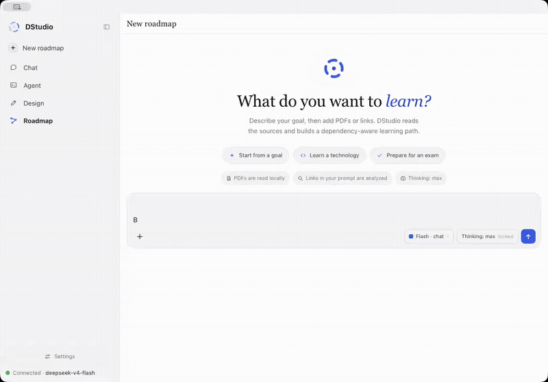
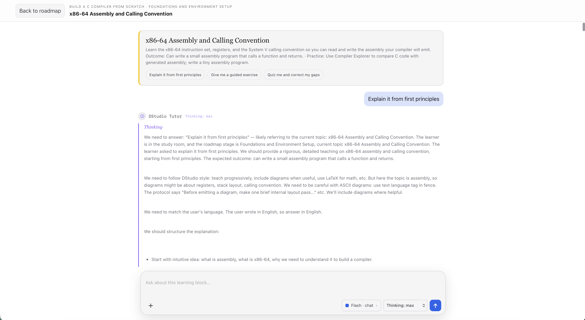

<div align="center">


# DStudio: Local AI Studio

**An open-source, local-first workspace for DeepSeek V4, GLM 5.3 Flash and Laguna S 2.1: private chat, researched learning roadmaps, coding and knowledge-work agents, visual design, multimodal documents, Web Research, image generation/editing and MiniMax H3 video. A cloud account is optional.**


</div>

DStudio turns [ds4](https://github.com/antirez/ds4), antirez's native local inference engine, into a complete desktop AI workspace. One UI combines private Chat, evidence-backed Learn paths and Tutor rooms, Agent with Plan/GSA/RSA workflows, document-focused Cowork, a gated Design studio, local image understanding/generation/editing and optional MiniMax H3 video. Model execution, project files and generated artifacts stay under the user's control by default.

Network access is still explicit and documented. Installation and model setup download source archives and weights from GitHub or Hugging Face; Web Search, Learn links and Deep Research read public websites; and the optional DeepSeek API backend sends the selected Chat, Learn, Agent, Cowork or Design requests to DeepSeek when the user supplies an API key. DStudio has no telemetry and does not require a cloud account for its local inference path.

In plain terms: DStudio is a **multi-model ds4 GUI**, a **private coding and knowledge-work environment**, and a **local research, media and design studio** packaged as one open-source project.

On macOS it ships as **DStudio.app**: double-click from Finder, no Terminal. On Windows it ships as a portable folder with `DStudio.exe` and the DS4 runtime binaries. The UI is a single vanilla `index.html` embedded in a small C launcher, so there is no Electron bundle, no framework build step, no CDN and no telemetry.

## Install on macOS

Download the Apple Silicon zip from [GitHub Releases](https://github.com/sk8erboi17/DStudio/releases), extract it and move **DStudio.app** to Applications. The app is ad-hoc signed but not Apple-notarized (notarization requires a paid Apple Developer account), so Gatekeeper may warn that Apple cannot verify it. To open it the first time:

1. **Right-click** DStudio.app → **Open** → **Open** in the confirmation dialog, or
2. [**System Settings → Privacy & Security → Open Anyway**](https://support.apple.com/guide/mac-help/mh40616/mac), or
3. from Terminal: `xattr -cr /Applications/DStudio.app` (clears the download quarantine).

The warning appears only because the app is not notarized; the build is reproducible from this source and ad-hoc signed.

**Easiest install (no paid Apple Developer account)** — this downloads the release, verifies its SHA-256, removes the download quarantine and installs to `~/Applications`:

```sh
bash <(curl -fsSL https://raw.githubusercontent.com/sk8erboi17/DStudio/main/scripts/install-macos.sh)
```

Or use the DMG from the release: open it and drag **DStudio.app** into Applications, then open it once with right-click → Open.

The first-run screen installs the pinned `ds4` engine into `~/Library/Application Support/DStudio`, then offers the supported GGUF models with their real download sizes. The default Flash transfer can be stopped and resumed after a restart, and DStudio verifies its exact size and SHA-256 before completion. Engine source, models and optional tools stay outside the signed app bundle, so updating or moving `DStudio.app` does not delete them.

The regular `chat-v2` Flash GGUF and the similarly sized community **abliterated** Flash GGUF are separate models. DStudio does not describe the latter as universally “uncensored”: its [model card](https://huggingface.co/apetersson/DeepSeek-V4-Flash-0731-Abliterated-DS4-Headroom128) calls it an experimental refusal-direction edit and says that refusal-removal validation is still pending. Treat `abliterated` as the model variant, not as a guarantee about every response.

To build from source instead:

```sh
make
open DStudio.app        # macOS
# or: ./dstudio         # Linux/headless workflows
```

Windows users should use the portable zip and run `DStudio.exe`.

On first launch, DStudio runs a local system check for the managed engine, selected
model, Chat and Agent/Cowork/Design runtimes, Cowork Office bridge, Web Search and
network state. Missing pieces show a direct **Choose**, **Download**, **Install**,
**Start** or **Settings** action.

## What You Can Do

- Run **DeepSeek V4, GLM 5.3 Flash or Laguna S 2.1 locally** through the same native desktop interface and unified GGUF picker.
- Use a **private AI chat** with persistent KV cache, reasoning display, citations from optional Web Search and local history.
- Use **Learn** to build an interactive learning path from a goal, PDFs and source links, with prerequisite ordering, exercises, checkpoints and locally saved progress.
- Open a dedicated **Tutor** for any roadmap block, with that block's prerequisites, sources, exercises and conversation restored automatically.
- Run **Web Search or Deep Research** through DStudio's local browser/search helper, with read-page evidence and source cards.
- Send image pixels directly to **DeepSeek V4 Flash Vision-Exp** or **GLM 5.3 native vision** in Chat, Agent, Cowork and Design. Older DeepSeek checkpoints and **Laguna S 2.1 are strictly text-only**. Generate directly with **Ideogram 4 FP8** or edit source pixels directly with **HunyuanImage 3 NF4**.
- Generate text-to-video or image-to-video clips with synchronized audio through the optional local **MiniMax H3** pipeline.
- Use a **local coding agent** that reads, edits and verifies files inside a folder you choose.
- Use **Cowork** for source-grounded spreadsheet, PDF, document and presentation work with native Office tools and no arbitrary shell.
- Toggle **Plan** to produce a decision-ready Markdown execution plan without modifying the project.
- Create and load **Skills**: private instruction packs authored by the current user for Agent, Cowork and Design.
- Run **Guided Security Analysis (GSA)** for authorized reviews, or **Reverse Structure Analysis (RSA)** to turn public website evidence into a labeled `STRUCTURE.MD`.
- Generate and refine complete interfaces with **ds4-design**, deterministic desktop/mobile checks, visual review and export gates.
- Select an optional **DeepSeek API** backend while all Agent, Cowork, Design and security tools continue to execute locally.
- Keep the engine private while still reaching the UI from another device on your LAN.

## Modes

A sidebar switches between Chat, Agent, Cowork, Design and Learn. Plan, GSA and RSA are explicit Agent workflows; Tutor rooms live inside Learn, while image/video generation is routed from Chat and Design. Every mode has reopenable local history, and every Agent, Cowork or Design conversation owns an independent on-disk KV session.

Local DS4 launches default to explicit expert **SSD streaming Off** while DS4 is
the sole heavyweight model. Metal uses full residency when the complete launch
fits and the engine's normal lazy memory-mapped path otherwise; DStudio does
not reduce the requested context to force residency. **On** remains available
as an explicit restart-time setting. Ideogram, Hunyuan and H3 are one-shot
workers: DStudio evacuates DS4 before loading one and restores it only
after that worker exits.

### Chat

<div align="center">


</div>

Streaming chat backed by the selected local GGUF and ds4 server KV cache: context lives server-side (prefix reuse is shown as *cached* tokens) and every message is saved locally. You get live tokens/s, collapsible reasoning, native MathML for LaTeX, syntax-highlighted code, file artifacts, image/PDF attachments and optional Web Search sources through the local browser. A configured DeepSeek API key can replace local inference without moving DStudio's workspace tools into the cloud.

With DeepSeek Vision-Exp or GLM 5.3 and the matching encoder installed, image attachments stay multimodal: DStudio sends PNG/JPEG pixels to `ds4-server`; Agent/Cowork use upstream `view_image`, and Design uses its native `see_image` implementation. There is no text-description detour or secondary visual model. Selected PDF pages can use that same active encoder; older DeepSeek checkpoints and Laguna expose no image tools and remain text-layer-only for PDFs.

### Learn — interactive learning paths

<div align="center">



</div>

Describe what you want to learn and optionally attach PDFs, notes or public links. Every Learn path starts with mandatory Deep Research—even when the prompt contains no link. Discovery tries Google first in DStudio's Chrome session. If Google renders an anti-bot page, that attempt is recorded as failed and discovery continues through Brave, Bing and DuckDuckGo; every search page and every selected source is opened exclusively through CDP. The Learn path never uses Bing RSS, static DuckDuckGo HTML or `curl`. DStudio filters low-value results, selects a strong and diverse set of pages, opens them in Chrome and extracts evidence from the rendered content; dynamic or lazy-loaded pages are scrolled until their text, links and content blocks stabilize before extraction. DStudio searches for authoritative curricula, official/current documentation, prerequisite evidence, practical exercises, assessment criteria and common learner pitfalls; supplied links and local PDFs are included as evidence but never treated as the entire research plan. Only after at least five substantial pages from four independent hosts and fifteen grounded curriculum facts pass the deterministic floor does a semantic judge decide whether the actual knowledge gaps are closed. Its output is not given an arbitrary token or array cap, malformed JSON is retried without shortening the verdict, and failed browser reads do not count as research progress. DStudio then passes the complete evidence bundle directly to the Thinking max curriculum generator—there is no redundant prose-report generation between research and curriculum synthesis.

The generated path records explicit cross-topic prerequisites, key concepts, effort estimates, observable outcomes, substantial practice, mastery checks, stage objectives, integrated checkpoints and a final project with concrete deliverables. It does not use a preset topic catalogue or fixed stage/topic quota. Granularity follows the researched subject and learner goal: a broad field with several independent outcomes or prerequisite chains becomes multiple stages or branches, while a narrow skill remains a compact block or path; stage sizes may differ and filler is never added to meet a count. Roadmap generation does not send an arbitrary `max_tokens` cap: Thinking max and the final JSON may use all space left in the loaded model's physical context window. A structural quality gate first rejects shallow, physically truncated or malformed drafts. DStudio then runs a separate adversarial factual audit on every stage, followed by a global pass that looks for contradictions across stages, exercises, assessments and the capstone. High-confidence findings trigger a complete repair and the entire factual audit runs again. Only a factually clean draft reaches the independent curriculum judge, which evaluates coverage, sequencing, granularity, practice, assessment, personalization, source use and capstone quality without taking over fact-checking. A curriculum repair is audited again from the factual stage; the loop ends only when both responsibilities pass or the learner presses **Stop**. The result opens directly as an editable graph inspired by [roadmap.sh](https://roadmap.sh/) rather than as a conventional assistant reply: blocks can be completed, reordered with drag-and-drop, or deleted. Adding a block sends its title, description, stage and neighboring prerequisites back to the model with Thinking max so it can create a coherent outcome and hands-on exercise instead of inserting placeholder text. Block generation uses a large output budget and automatically repairs and retries incomplete drafts until it obtains a valid block or the learner presses **Stop**. The edited graph is saved with that roadmap's history and can be exported as high-resolution PNG, PDF or JSON.

#### Study with a dedicated Tutor

<div align="center">



</div>

Every stage, topic and final project has a **Study** button. Clicking it opens a dedicated full-screen Tutor chat for that exact block, without the Roadmap sidebar getting in the way. The Tutor already receives the roadmap goal, stage, prerequisites, learning outcome, practice task and source context, so the learner does not have to explain the subject again. It can teach from first principles, answer follow-up questions, give guided and independent exercises, run quizzes, identify gaps and correct the learner's work. **Back to roadmap** returns to the graph without losing the study conversation.

The Tutor keeps the normal Chat toolset while remaining focused on the selected learning objective: selectable and visible Thinking, drag-and-drop files, local PDF and image understanding, LaTeX, aligned ASCII diagrams, collapsible hints and generated-file canvas previews. Each block owns its transcript and attachments, so opening **Study** again resumes the same lesson and progress instead of starting a generic chat.

Learn generation and both verification roles are always locked to **Thinking: max**. Local ds4 requires at least 393,216 context tokens for Max rather than its High fallback, so DStudio temporarily launches the Learn pipeline at that threshold when the saved Chat context is smaller. This launch override is not persisted: the learner's normal Chat context setting remains unchanged and is used again by the next ordinary Chat request. Cloud inference receives the explicit Max request directly.

## Multimodal PDFs

<div align="center">


</div>

Attach a PDF and ask naturally in any language. The active model decides whether to build a bounded whole-document overview, read an exact physical page or search semantically across every page. DStudio extracts text locally and uses the small pinned **Qwen3-Embedding-0.6B only as a text embedding index**, never as a visual router. With DeepSeek Vision-Exp or GLM 5.3 active, DStudio additionally renders up to four selected physical pages and sends those pixels to that same model's native encoder. Laguna and other text-only checkpoints receive only the extracted text and explicitly report any scanned/image-only pages they could not interpret. The cached text index keeps prompts bounded even for 1,000-page books.

## Local Image Generation

<div align="center">


</div>

Ask for an image naturally in any language. DeepSeek Vision-Exp or GLM 5.3 interprets the request and any source pixels itself, then emits an explicit `generate` or `edit` directive. DStudio dispatches `generate` directly to Ideogram 4 FP8 with its official 48-step Quality profile, and `edit` directly to the full, non-distilled HunyuanImage-3.0-Instruct model. Text-only models cannot issue source-dependent edits. Hunyuan uses NF4 so it fits the 96 GB reference Mac while critical layers and compute remain BF16; it runs `think_recaption` and 50 diffusion steps through Tencent's official eager DeepSeek MoE implementation with no routed-token dropping or custom numerical forward.

The reply gets a placeholder immediately while DStudio reports real load, reasoning, sampling and decode phases. Quality is fixed at Ideogram Quality-48 or Hunyuan full-50: there is no Turbo, distilled or smaller-model fallback. One kernel-owned lock serializes Ideogram, Hunyuan and H3, while the media-memory lease temporarily evacuates a resident chat/Design model when required. Generated files stay local and are attached to the conversation for later edits.

## Local Video Generation (MiniMax H3)

DStudio runs the downloadable MiniMax H3 weights through a pinned [antirez/h3.c](https://github.com/antirez/h3.c) checkout: a native C/Objective-C engine built directly on Metal, MPSGraph and Accelerate. ComfyUI, PyTorch and third-party custom nodes are not part of video inference. Ask for a video in Chat; DStudio routes the request to the one-shot native executable, optionally uses a recent attached image as the first frame, reports h3.c's real phase/denoise callbacks and returns a locally streamed MP4. You can also ask DStudio to **create an opening image and then animate it**: the still goes directly to Ideogram 4, is kept in the conversation, and is then passed to h3.c. No hosted generation API is used.

> **Working in progress — two-photo H3 references.** With MiniMax H3 selected in the composer, one attached image remains an opening-frame anchor; two attached images are ordered Ref2VA inputs exposed to the model as `<Picture 1>` and `<Picture 2>`. Settings includes a separate preparation action for the official Ref2VA transformer (about **61.7 GiB / 66 GB** in addition to FL2VA) while reusing the existing encoder and VAE files. This path is currently experimental and has not yet completed end-to-end validation in DStudio.

Open **Settings → Video** before the first generation. Review the upstream terms, confirm that your territory and intended use are authorized, then select **Prepare local H3**. Setup checks out and compiles an immutable h3.c revision without loading the engine, then downloads only the official `FL2VA/` files required for text/image-to-video. That original BF16 snapshot is about **134 GiB (144 GB)** on disk; partial files resume automatically. The managed runtime lives at `~/.dstudio/minimax-h3`; prompts, source frames and generated videos stay on this Mac. Existing converted ComfyUI checkpoints are a different layout and are not reused or deleted.

H3 has its own [Community License Agreement](https://huggingface.co/MiniMaxAI/MiniMax-H3/blob/main/LICENSE), including territorial, commercial and acceptable-use conditions. DStudio does not grant authorization; it requires an explicit confirmation before downloading or generating. Native h3.c requires MiniMax H3's official BF16 Qwen-family text encoder and checkpoint layout; this is an internal H3 component, not DStudio's removed visual router. During generation DStudio releases the chat model once, runs direct Ideogram opening-frame generation when requested, then launches h3.c. The upstream engine loads and releases its encoder, transformer and decoders in separate phases.

Three render profiles expose h3.c's native controls. **Quality is the default**: it uses all 50 blocks, no denoiser reuse and documented 768p-class output sizes. **Balanced** uses the upstream validated controls `--layers 45 --reuse 2` at roughly 512-class dimensions. **Preview** keeps 20 steps but uses 40/50 DiT blocks, whole-denoiser reuse 3 and a reduced internal canvas that is upscaled to the selected output size. The user can change profiles in Settings, but DStudio never changes one automatically to save time; a lower profile is used only when the user selects it or when a reproducible engine bug is explicitly reported. Video cost grows sharply with pixel area and duration, so Quality can take substantially longer. M3 and older GPUs automatically use h3.c's portable BF16/MPS path; M5-class hardware can select its native Metal 4/TensorOps paths. The progress card remains in conditioning until h3.c emits denoise progress, then shows actual completed native steps and derives an ETA from measured step time.

## Search & Deep Research

<div align="center">


</div>

Search runs through DStudio's local web helper, not a hosted browsing service. **Web Search** is the fast mode: it plans targeted queries, reads the best pages, extracts facts and answers with clickable citations. **Deep Research** uses the same tools with a longer evidence loop: classify the request, search, read primary sources, extract facts, judge sufficiency, synthesize a grounded report and keep the source cards attached to the answer.

### Agent

<div align="center">


</div>

`ds4-agent` becomes a local coding agent: it reads and edits files, runs commands inside a working directory you choose, streams its answer while it works, folds private reasoning into a **Thought** disclosure and groups structured tool calls/results into a compact action timeline. Every user turn has a copy control that returns the exact visible prompt even while the transcript is updating. The session header always shows the active mode, model and working folder; `/help`, `/list`, `/save`, `/new` and `/compact` remain available below the composer. A post-edit verifier catches common syntax errors immediately, so the model can repair broken code in the same turn. The same surface exposes Plan, GSA and RSA without silently turning any of them into an unrestricted autonomous mode.

Thinking defaults to **high**. Selecting **max** below its real 384k-token engine threshold explains the required context and estimated Metal residency cost before restarting; declining changes nothing, while leaving max restores the user's previous context. Existing video-quality choices and other saved Settings are preserved during that migration.

### Cowork

Cowork turns the same local DS4 engine into a knowledge-work partner for a folder of real files. It can inventory and read PDF, DOCX, PPTX, ODT, RTF, Markdown and text sources; inspect/read/write XLSX, CSV and TSV data; create verified documents, paginated PDFs and 16:9 presentations; and reopen its outputs before reporting completion. Its attachment flow matches Chat: dropped files appear as clean preview tiles under the user message while tool-only paths stay out of the visible transcript. Uploaded names are sanitized, macro-enabled formats are rejected, writes are atomic and native read surfaces are confined to the selected workspace, including symlink and traversal checks.

The Office bridge is a small standard-library Python helper invoked through `fork` + `exec` with a bounded JSON request—there is no command shell or arbitrary Python execution in Cowork. Its dedicated `write_pdf` operation creates a valid paginated PDF directly, so the model no longer needs to look for `bash`, LibreOffice or an external converter. Spreadsheet cell text and extracted document/PDF text are framed as untrusted source content, so embedded instructions are not treated as tasks. Cowork uses the context size selected in Settings (it no longer forces 393,216 tokens), keeps a separate SSD-friendly KV cache under `.ds4/cowork-kvcache`, and uses the same live conversation surface, streaming response, collapsed Thinking view, action timeline and session commands as Agent. Its **+** menu retains Cowork-specific actions for attaching Office/PDF files, adding or changing the source folder and selecting a local Skill.

## Skills: local task recipes

<div align="center">


</div>

Skills turn DStudio from a general assistant into a focused specialist for the job in front of you. Create a recipe, pick it, and the next Agent, Cowork or Design turn inherits its workflow, constraints and quality bar without restarting the model.

DStudio does not ship or download a skill marketplace. Every available skill is a local Markdown instruction pack created by the current user, stored in the writable user data directory and injected only when selected. Agent, Cowork and Design use this same user-only catalog and continue normally when it is empty. GSA and RSA instead use their deterministic phase templates and managed tool catalog.

## GSA: guided security analysis

<div align="center">


</div>

GSA gives the Agent a security-analysis operating mode instead of a loose prompt. Turn it on, describe an **authorized** mission and optionally add a target URL; DStudio turns that into a guided run with clear scope, an explicit tool inventory, target context and a paper trail of artifacts. GSA and RSA do not load skills: they route only through deterministic collectors, bounded local helpers, and enabled tools.

The experience is productized, but the mechanics stay inspectable: **selection** chooses files and hypotheses; **preflight** maps evidence, trust boundaries and safe checks; **validation** gathers concrete proof with bounded scripts or optional local tools; **report** produces a compact verdict with sources, limitations and next actions. Security profiles distinguish passive, blue-team, explicitly authorized red-team and purple-team work; the run can never infer authorization from the prompt alone. External tools are evidence helpers: DStudio shows what each one does, lets you disable it, records failed invocations and keeps a normalized evidence workbench. **Install missing** executes a supervised background installer, exposes its task/log state and refreshes the catalog automatically when it finishes.

Each GSA/RSA phase is committed through a native structured control call and validated again by the host. Partial JSON streamed as prose is held in a bounded pending card and can never advance the pipeline or leak into the final answer. If a completed turn has the right work but the wrong envelope, DStudio grants one format-only recovery turn with tools disabled; a second invalid result leaves the run explicitly incomplete. The watchdog also waits while inference or a tool is genuinely active, so a slow evidence collector is not killed as an idle phase.

The Agent timeline recognizes every command in the managed GSA catalog and keeps its complete effective parameters visible in both the running and completed action row. Long invocations wrap instead of being clipped. Parameter values are shown verbatim—including tokens, passwords, cookies, authorization headers and URL query values—and the expanded row retains the exact command and its output.

### RSA: reverse structure analysis

RSA is the non-security reverse-structure workflow. It inventories a public site's visible routes and assets, captures ordinary browser/network evidence, maps frontend, public API, product-flow, data and infrastructure clues, and writes `STRUCTURE.MD` in the selected workspace. Claims are labeled **VERIFIED**, **INFERRED** or **UNKNOWN**; an evidence audit and final review gate prevent external guesses from being presented as private implementation facts. RSA shares GSA's managed tools but never scans, fuzzes, brute-forces or calls private endpoints outside normal navigation.

## Design: a studio built **on** ds4

Design is not a chat skin. It is a separate local design agent that runs a designer's pipeline end to end. **`ds4-design` is DStudio's own extension to ds4**: it lives in this repo (`extension/design/ds4_design.c`), uses the selected ds4 model backend, and has its own system prompt, tools, staged flow and native structured events.

<div align="center">


</div>

The whole pipeline, from a one-line idea to laid-out screens:

- **1 · Brief and questions.** Design starts with a structured interview instead of a blank prompt: what you're making, target platform, tone, brand direction, scale and constraints.
- **2 · Generating.** It loads the right skills/design systems, writes a short plan, builds the screens and shows live progress from real runtime events instead of raw tool noise.
- **Reasoning control.** Thinking effort and context capacity are independent. Design honors the context selected in Settings (with a 32k minimum) even at Thinking Max instead of silently allocating 393,216 tokens. Max keeps hidden reasoning unlimited across tool rounds; the optional 8k, 16k and 24k caps close only the model's native `</think>` block and leave the visible/tool response unrestricted.
- **3 · Proposal.** It can offer distinct directions to compare side by side, each with a name and rationale; pick one to refine or use.
- **4 · Native visual loop.** With DeepSeek Vision-Exp or GLM 5.3, Design can generate a project-local PNG directly with Ideogram 4 or edit supplied pixels directly with HunyuanImage, then inspect the result using the same selected model and its native encoder. The composed desktop/mobile page is graded in a native multimodal turn alongside deterministic 1280/390 px DOM evidence. Text-only engines, including Laguna, do not expose this visual loop.
- **5 · Quality gate, canvas and export.** Deterministic checks (including balanced structural HTML, visible literal-copy preservation, stale-copy removal, real horizontal overflow, overlapping controls and excessively stretched sparse panels) plus a role-weighted critique (minimum 8.5) block or warn on weak HTML before artifact registration. Every accepted screen lands on the canvas for refinement and zip export; reopening its Design conversation reconstructs that canvas from the persisted artifact instead of dropping back to transcript-only history. In the full-screen preview, **Select to edit** highlights the exact DOM element and opens a contextual comment directly beside it; choose General, Layout, Text, Style, Image or Video and send the bounded selector/text/geometry evidence back to Design. The preview stays in an opaque sandbox, while Design measures the selector and inspects the rendered page before applying a targeted revision.

## Plan: from a rough goal to a Markdown execution plan

Toggle **Plan** in Agent mode, describe what you want, and DStudio writes a **Markdown planning file** into the selected workspace. It is intentionally planning-only: no scaffolding, no hidden implementation flow. The agent turns the request into a concrete `plan.md` or `<topic>-plan.md` with assumptions, milestones, tasks, risks and validation steps.

**1 · You describe the outcome.** Give it a product idea, feature, workflow, migration, research task or implementation goal.

**2 · It plans instead of building.** The agent makes reasonable assumptions, scopes the work and writes a Markdown file in your workspace.

**3 · The file is useful immediately.** The plan includes objective, assumptions, deliverables, milestones, task breakdown, technical/design decisions, risks, validation checklist and next actions.

**4 · Then you decide.** Turn Plan off and use Agent/Design to implement, or keep the Markdown file as the execution reference.

## Task Graph runtime

DStudio 1.1 includes the host-authoritative Task Graph V1 execution core as shared infrastructure rather than a new sidebar mode. It parses and strictly validates bounded DAG proposals, rejects cycles, unsafe paths and invalid retry/side-effect combinations, persists an append-only event journal before exposing transitions, rebuilds its materialized state after a crash, and provides optimistic-concurrency controls for approve, start, pause, resume, cancel, retry and skip. One global model lease and one workspace-writer lease prevent accidental double use while independent synthetic host nodes exercise bounded fan-out/fan-in.

The first rollout intentionally exposes real Agent/Plan/GSA/RSA graphs as **validated proposals only** until each real executor clears its own model-quality gate. Starting an unregistered proposal fails before appending `graph.started`, so it cannot leave a run stuck half-started. Ordinary Agent, Plan, GSA and RSA behavior therefore remains unchanged in 1.1, while the durable core, recovery path and local HTTP contract are already packaged and regression-tested. See [`extension/task-graph/README.md`](extension/task-graph/README.md) for the store/API contract and staged adapters.

## Highlights

- **Local-first & private.** Core inference runs on your machine by default, with no telemetry and a strict CSP. Model downloads, Web Research and the optional DeepSeek API backend are the documented outbound paths and activate only when the user requests or configures them.
- **Self-contained native app.** The UI is one vanilla file base64-embedded in the binary. No Electron, no asset server, no CDN.
- **Non-invasive integration.** The agent's structured output comes from a small, **reversible, build-time patch** of the engine source: DStudio backs it up, builds a separately-named binary and restores the original immediately. The current DStudio release requires this structured runtime and fails clearly if its pinned patch cannot be built.
- **Setup doctor.** First run checks the ds4 folder, GGUF model, chat engine, Agent/Cowork/Design runtimes, Cowork's Python helper, Web Search, port and LAN state, then gives a direct fix button.
- **Clear controls and startup state.** The composer **+** menu groups labelled attachment, workspace, Skill and workflow actions by mode. App boot and engine changes show real launcher phases, segmented progress, runtime/context/power instruments and deduplicated structured logs. Agent, Cowork and Design expose actual system-prefill token counters; an unknown prefill duration is labeled as such instead of presenting a false linear ETA.
- **Local tools with a remote model.** The optional DeepSeek API and LAN-host backends replace inference only; Agent, Cowork, Design, GSA and RSA tools remain on the client machine with the selected workspace.
- **Pinned and repairable runtimes.** Setup and the update center install immutable engine/media revisions, verify patch anchors, rebuild separately named runtimes and keep resumable weight transfers outside the app bundle.
- **Configurable networking.** Localhost by default; Settings can change DStudio's web/LAN port or expose the UI on trusted Wi-Fi, while the model engine still never leaves localhost (see below).

## Who It's For

DStudio is for local-AI builders who want one inspectable desktop workflow for private chat, coding, Office/document work, research, design and media generation. It is intentionally hardware-hungry: choose a GGUF that fits your machine, keep enough disk for optional media workers, or use the DeepSeek API backend while local tools and files remain on your computer.

## Requirements

This is a serious local AI setup. DStudio removes product friction, not physics:

- **OS.** One `make` builds the branded app per platform: **DStudio.app** on **macOS** (Apple Silicon is the primary tested target), a **`dstudio`** binary on **Linux** (WebKitGTK / GTK3 via `webkit2gtk-4.1`) and a portable **Windows x64** folder/zip via `make windows`. Linux and Windows are less exercised, and `ds4` itself must be built for your platform.
- Apple Command Line Tools (`xcode-select --install`) or another C compiler (`cc` / `clang`). `curl`, `tar` and `make` are used by first-run setup to download and build the pinned upstream `ds4` source archive; `node` is optional, only for `make check`.
- **[antirez's ds4](https://github.com/antirez/ds4)**: DStudio keeps the primary `./ds4` checkout pinned to upstream `main`; only Laguna currently needs a managed side-by-side engine directory. Every engine shares the single physical model store at `./ds4/gguf`. Source archives receive the relevant local patch set from `patch/`; users do not need Git installed.
- **A supported GGUF model.** The managed menu currently offers DeepSeek V4 plus the optional model families documented below. DeepSeek variants include:
  - **Flash**: ~87 GB on disk, ~96-128 GB RAM
  - **Pro**: ~430 GB on disk, ~512 GB RAM

  Missing the weights? The first-run and Settings model menus show every
  supported DeepSeek—including Vision-Exp—GLM and Laguna download with its quantization and exact size.
  GLM runs on the primary `main` engine; selecting Laguna installs its managed
  side engine automatically. Every download—including optional model
  families—is stored in `./ds4/gguf`. While a transfer is incomplete, its bytes
  are visible there as `<model>.gguf.part`, in the same directory opened by
  **Open folder**; DStudio no longer starts new model downloads in Hugging
  Face's hidden `.cache` tree. Stop, app restart and Resume reuse that file.
  This behavior is a reversible DStudio patch applied when an engine checkout
  is installed or selected, so the upstream `download_model.sh` stays unchanged
  in the source repository.

> The local models are intentionally large. If the selected GGUF does not fit your hardware, the screenshots show the native workflows and the optional DeepSeek API backend can provide inference while workspace tools stay local.

`ds4-design` lives in **this** repo (`extension/design/ds4_design.c`) and is compiled into the ds4 repo automatically the first time you open Design.

### MiniMax H3 video (optional)

The local video pipeline is independent of the selected chat GGUF and currently supports **Apple Silicon macOS only**.

- Install Xcode Command Line Tools (`git`, `clang` and `make`), `python3` for the small download/launcher manager, and `ffmpeg`/`ffprobe` for MP4 output before selecting **Settings → Video → Prepare local H3**. A typical Homebrew setup for the media dependency is `brew install ffmpeg`.
- Keep at least **145 GiB free**, plus room for generated videos and any old converted checkpoints. Setup reserves 8 GiB of working headroom beyond the missing official files.
- The runtime and resumable weights are stored under `~/.dstudio/minimax-h3`, outside `DStudio.app`.
- Video generation needs substantial unified memory. h3.c separates the Qwen, transformer and decoder phases so they do not coexist, but a lower reliable minimum has not yet been established. M3 and older hardware uses the portable BF16/MPS path; newer Metal hardware may enable additional native TensorOps kernels.
- Review the current [MiniMax H3 license](https://huggingface.co/MiniMaxAI/MiniMax-H3/blob/main/LICENSE) and obtain any authorization required for your territory and use. DStudio's checkbox records the user's confirmation; it is not a license grant.

### DeepSeek V4 Flash Vision Experimental (optional)

Upstream [`ds4/main`](https://github.com/antirez/ds4#deepseek-v4-flash-vision-experimental) now supports DeepSeek V4 Flash Vision-Exp directly. **Vision-Exp is a separate language checkpoint**, not an encoder upgrade for the older 0731 text GGUF shown in the original download menu.

- **Recommended model**: select **DeepSeek V4 Flash Vision-Exp · IQ2_XXS** in the unified download menu, or run `./download_model.sh ds4f-vision-q2`. The target downloads the ~86.7 GB / 81 GiB language GGUF and its matching 932,857,760-byte encoder together. Mixed Q2/Q4 (~97.6 GB / 91 GiB) and MXFP4 (~156 GB / 145 GiB) variants are also listed.
- **Existing language model**: if the matching Vision-Exp GGUF is already present, **Settings → Vision** can download only `DeepSeek-V4-Flash-Vision-Encoder.gguf` with `./download_model.sh ds4f-vision-encoder`.
- **Native image path**: DStudio supplies `--vision gguf/DeepSeek-V4-Flash-Vision-Encoder.gguf` automatically. Chat sends PNG/JPEG image blocks directly; Agent and Cowork use ds4's built-in `view_image` tool, and Design uses native multimodal inspection. No secondary visual model is inserted.
- **DSpark**: Vision-Exp has its own `DeepSeek-V4-Flash-Vision-Exp-DSpark-support.gguf`, downloadable as `ds4f-vision-dspark`. It is not compatible with the older 0731 DSpark support file, and DStudio selects the matching file from the active language checkpoint. When the main model, DSpark support model and requested context exceed the estimated Metal memory budget, DStudio explains the memory-pressure risk and asks before launch; confirming starts the requested DSpark configuration instead of silently disabling it.

### GLM 5.3 Flash (optional)

**GLM 5.3 Flash is merged into upstream [`ds4/main`](https://github.com/antirez/ds4#glm-53-flash).** DStudio pins that main revision for the primary `./ds4` runtime; there is no separate GLM source checkout, setup endpoint or branch switch anymore. DeepSeek and GLM share the same binaries and `./ds4/gguf` store.

- **Model**: the unified menu exposes GLM 5.3 Flash Q2 (~96.5 GB / 90 GiB).
  Its GGUF is stored at `./ds4/gguf/GLM-5.3-Flash-Q2.gguf`; the equivalent CLI
  command is `./download_model.sh glm53-q2`.
- **Native vision**: **Settings → Vision → Download native encoder** installs
  `GLM-5.3-Flash-Vision-Encoder.gguf` (1,127,280,960 bytes, about 1.13 GB) in
  the same model store. The equivalent CLI command is
  `./download_model.sh glm53-vision`. DStudio then starts Chat, Agent and Cowork
  with `--vision` automatically. Chat sends inline image blocks directly to
  GLM; Agent and Cowork use ds4's built-in `view_image` observation instead of
  DStudio's `see_image` text-description detour.
- **Use**: pick the GLM GGUF from the model list. The primary `./ds4` runtime
  drops `--power` (unsupported by GLM). If the user enables SSD streaming,
  DStudio uses the GLM full-layer prefill path and a 32 GB expert-cache budget.
- **Memory notice, not a forced profile**: the Q2 file is about 90 GiB, so its
  selection shows a warning on memory-constrained Macs. DStudio does not clamp
  context or force SSD streaming for GLM. The managed main patch removes the
  fixed pre-launch host-memory rejection and leaves real Metal allocation errors
  authoritative; users can enable SSD streaming explicitly if needed.

### Laguna S 2.1 (experimental, optional)

DStudio supports Poolside **Laguna S 2.1** through ds4's
[`laguna-s2.1` branch](https://github.com/antirez/ds4/tree/laguna-s2.1), pinned
and installed beside the main engine:

- **Install and model**: select **Laguna S 2.1 · Q4_K_M** in the unified model
  download menu. DStudio installs and selects the pinned `laguna-s2.1` engine
  in `./ds4-laguna-s21`, links its model folder to `./ds4/gguf`, then starts the
  GGUF download automatically. The
  equivalent manual controls are the Doctor **Install** action,
  `POST /api/laguna/setup`, and `./download_model.sh laguna-q4`. The official
  imatrix GGUF is about 68 GB. The download row shows percentage and transferred
  GB, supports **Stop/Resume** through one stable resumable partial, and offers
  **Delete partial** with confirmation while paused; completed GGUFs are never
  removed by that cleanup action.
- **Use**: select `laguna-s-2.1-Q4_K_M.gguf` in the model menu. DStudio passes
  the Laguna Metal source path automatically and labels the model correctly in
  conversations.
- **Requirements**: the current upstream implementation is macOS Metal-only
  and requires full model residency. DStudio disables automatic SSD streaming
  for Laguna and rejects attempts to force it on.
- **Vision**: Laguna is exposed as a text-only runtime. DStudio does not route
  its image attachments through another model, does not inject `see_image`/`view_image`,
  rejects Agent/Cowork/Design image drops and reads only PDF text layers.

### Windows notes

For normal use, download/extract the Windows portable zip and run `DStudio.exe`. Keep the files together: `DStudio.exe`, `ds4-server.exe`, `ds4-agent-jsonl.exe`, `ds4-cowork.exe`, `ds4-agent-jsonl.ver`, `ds4-design.exe` and the packaged `extension/cowork` helper are meant to live in the same portable folder. Cowork currently also requires a reachable Python 3 runtime.

If you build DStudio or use Agent/Cowork/Design from a LAN client with your own local DS4 checkout, install:

- **Microsoft Edge WebView2 Runtime** if your Windows install does not already have it.
- **MSYS2 POSIX** build tools: `pacman -S make patch gcc`.
- **Visual Studio Build Tools** or `clang-cl` for building the native Windows wrapper.

The error `msys-gcc_s-seh-1.dll was not found` means Windows found `ds4-agent-jsonl.exe` but not the MSYS2 runtime it was built with. Install MSYS2 in `C:\msys64`; DStudio adds its runtime directories to `PATH` before launching Agent/Cowork/Design. Do not copy `msys-2.0.dll` or Cygwin/MSYS DLLs next to the DS4 binaries: that can make MSYS detect the wrong root and break `/tmp`, `fork()` and shell tools. LAN Agent/Cowork/Design model calls use DStudio's internal bridge; Agent/Design tools stay on the client, while Cowork uses its bounded Office bridge. First-run setup uses Windows `curl` and `tar` to download the pinned ds4 source archive; Git is not required.

## Development

For local development and headless runs, keep the web server explicit:

```sh
make run        # build + start on http://127.0.0.1:5500
make check-fast # deterministic unit, HTTP, UI and fixture checks; no model
make test-ui-live-vision DSTUDIO_LIVE_URL=http://127.0.0.1:5999
                # isolated Playwright E2E over the running saved Vision model:
                # Chat, Agent, Cowork, Design, Learn and Settings; no H3/image job
make test-task-graph-unit test-task-graph-http test-task-graph-bench-validate
make check      # check-fast plus explicitly configured real-model suites
make test-image-inference  # Ideogram/Hunyuan pinned Max-profile conformance
make test-video-open-weight  # H3 pinning, local-only contract and checkout repair
make dist-macos VERSION=1.1.0  # signed .app smoke test + release zip/checksum
```

Optional parameters:

```sh
make run PORT=8080 DS4_DIR=/path/to/ds4
# or directly:
./dstudio [web_port] [ds4_dir]
```

Dev loop: `DS4UI_PAGE_FROM_DISK=1 ./dstudio` serves `web/index.html` from disk (hot editing) instead of the embedded copy. `DS4UI_NO_WINDOW=1` runs headless (server only).

## Network (LAN)

DStudio is **localhost-only by default**. The web/LAN port can be changed live in **Settings → Network → DStudio port** and is reused on later launches. To use it from a phone, tablet or another Mac on the same Wi-Fi, choose **Settings → Network access → Enable on the LAN**. The app shows the exact address to open, e.g. `http://192.168.1.207:5500`.

<div align="center">
  
  &nbsp;&nbsp;&nbsp;
  
</div>

<p align="center"><sub>One toggle in Settings (left) → open the address on your phone (right). The model streams over the network, with no app to install on the device.</sub></p>

Behind the scenes DStudio **reverse-proxies the engine API** (`/v1`) to the local engine, so the engine itself never leaves `127.0.0.1`: a LAN client only ever talks to DStudio, and there's **nothing to configure**.

> ⚠️ With LAN enabled, anyone on that network can reach the shared chat/model proxy. Workspace, settings, store and Agent/Cowork/Design tool APIs remain local-only, but you should still use trusted networks and turn LAN access off when finished.

## How it works

- **C launcher, not a script.** `dstudio.c` is both the local HTTP server and the engine supervisor: it starts/stops `ds4-server` for chat, `ds4-agent-jsonl` for coding, `ds4-cowork` for Office work and `ds4-design` for design, manages working directories, runs the setup doctor, proxies `/v1`, serves Web Search and exposes a small local API.
- **Native window.** `app.cc` forks the server and opens a WKWebView (macOS) / WebKitGTK (Linux) window via `webview.h`; the page is base64-embedded (`page_data.h`).
- **Same-origin proxy.** The page calls DStudio for `/v1`; DStudio forwards streaming requests to the local engine, which is why LAN works with no engine exposure and no settings.
- **Durable Task Graph core.** A bounded DAG validator, append-first event store, cooperative scheduler and localhost-only API provide crash-safe orchestration foundations without reusing the transient `/api/tasks` telemetry ring. Heavy real-model A/B fixtures are prepared separately and are never run by `check-fast`.
- **Native vision only.** DeepSeek Vision-Exp and GLM 5.3 Chat/Agent/Cowork/Design use their ds4 native encoders directly. Every other engine is text-only; no secondary VLM, visual router or fallback is installed. Ideogram 4 FP8 Quality-48 creates new images and full HunyuanImage-3.0-Instruct NF4/50-step edits source pixels directly.
- **Text-first, native-vision PDF acceleration.** Poppler extraction, chunking and BM25 stay on the CPU. Qwen3-Embedding-0.6B ranks multilingual text only; it is not a router. DeepSeek Vision-Exp or GLM 5.3 can inspect a bounded selection of rendered pages through the currently loaded native encoder, while Laguna reports and skips image-only pages.

### The agent patch: building on ds4 without forking

ds4's agent is a separate, fast-moving codebase that can't be modified permanently. To get **structured output** with clean tool calls, folded reasoning and KV-session slash-commands over the pipe, DStudio applies a small, **additive and fully reversible** patch at build time:

1. it backs up the targeted upstream sources,
2. applies anchored edits for gated JSONL output and event emitters,
3. builds **separately named** Agent/Cowork runtimes while reusing compatible engine objects,
4. **restores the original upstream source immediately.**

The canonical `ds4-agent` source is restored after the JSONL build; the build is idempotent (a version stamp forces a rebuild only when the patch itself changes), and it self-heals on the next launch even after a crash. A patch mismatch is a startup error: DStudio does not maintain a second raw-output parser or silently downgrade the Agent. The managed runtime patches add multimodal hot-memory coordination, expose ds4's measured decode throughput, and correct GLM 5.3 streaming/catalog behavior; they are reversed/reapplied automatically around upstream pulls. (`ds4-design` is *our* code, in this repo, so it emits these events natively with no patch needed.)

#### ⚠️ The patch targets DStudio's pinned ds4 commit

The structured runtime is built against the **unmodified, pinned [ds4](https://github.com/antirez/ds4)** source: the patch finds its insertion points by exact anchors in `ds4_agent.c`. DStudio updates that pin and the patch together as one breaking release boundary.

Forks that change those anchors are unsupported by that release and the Agent refuses to start instead of running with partial behavior. This keeps one protocol, one renderer and one test surface while leaving the upstream checkout pristine.

### KV cache: how context is kept

The selected local model keeps conversation state in ds4-server's **KV cache** instead of re-encoding it from scratch every turn:

- **Chat** re-sends its history behind a **stable prefix**, so the server reuses the cached prefix automatically, shown as the blue *cached* token count under each reply. The KV cache is also written **to disk**, so context survives engine restarts.
- **Agent, Cowork & Design** get independent named KV sessions, autosaved every turn. Reopening a conversation restores its exact engine state, so threads do not share accidental context. Design also keeps an exact-text, model-validated cache of its bootstrap prompt: the first cold launch reports real prefill progress, while later launches restore that prefix without recomputing it. Selected Design systems and Skills are loaded by their native tools on the first user turn rather than copied wholesale into every startup prompt.

## Security

- **Localhost by default** (`DS4UI_HOST` overrides the boot host); the page is served from a fixed path: no client path ever touches the filesystem.
- Engine spawned with `fork`+`execv` (argument array, **no shell**): no command injection. Model from a fixed enum, integer parameters range-checked, working dir passed as a single argument.
- Mutating local APIs require the anti-CSRF header `X-Requested-With: ds4web`.
- Outbound traffic is feature-scoped: setup downloads from pinned GitHub/Hugging Face revisions, Web Research reads requested public sources, and the optional DeepSeek cloud backend contacts `api.deepseek.com` only after the user supplies a key and selects it.

> ⚠️ **Agent and Design** can run commands autonomously. Use a trusted project folder. Their workspace APIs remain local even when LAN chat is enabled. **Cowork** intentionally has no arbitrary shell and confines its native file/Office tools to the selected workspace.

## Project Roadmap

Where DStudio is headed (ideas, not promises):

- **Sharper Design studio**: broaden the visual-diversity corpus and add a second independent local render judge.
- **Sharper Plan mode**: richer Markdown plans with better assumptions, acceptance criteria and execution clarity.
- **MCP**: Model Context Protocol support so the agent can plug into external tools and data sources beyond the working directory.

## Contributing

DStudio is early, hardware-hungry and built for the local-AI crowd. The most useful contributions right now are setup reports, hardware reports, reproducible agent failures, design-output examples and small PRs that reduce first-run friction. If you want open-source local AI tools to exist outside cloud subscriptions, a ⭐ helps the project reach the right testers.

## License

[BSD 3-Clause](LICENSE) © 2026 Giuseppe Perrotta
