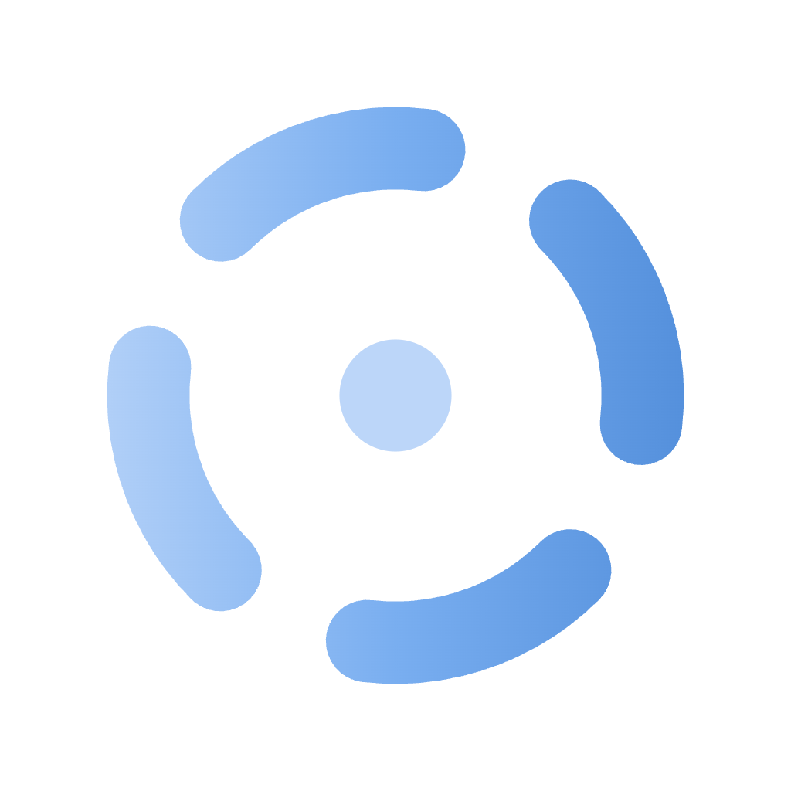
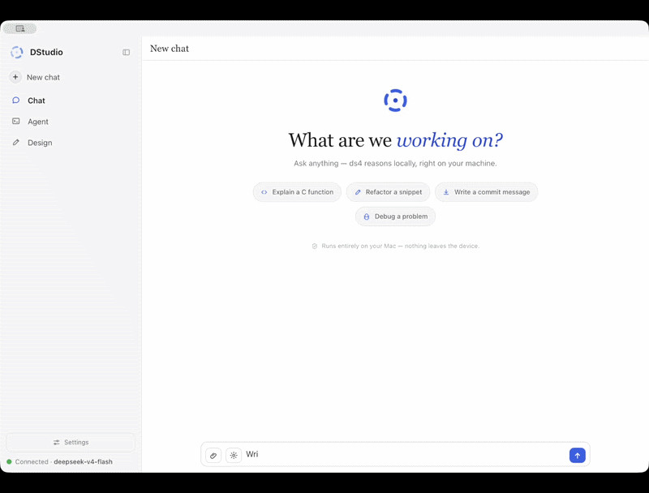
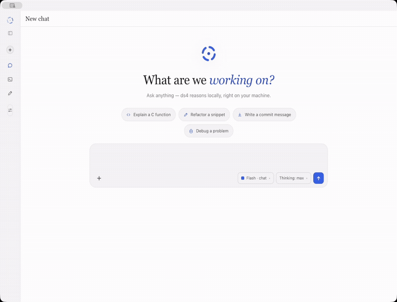
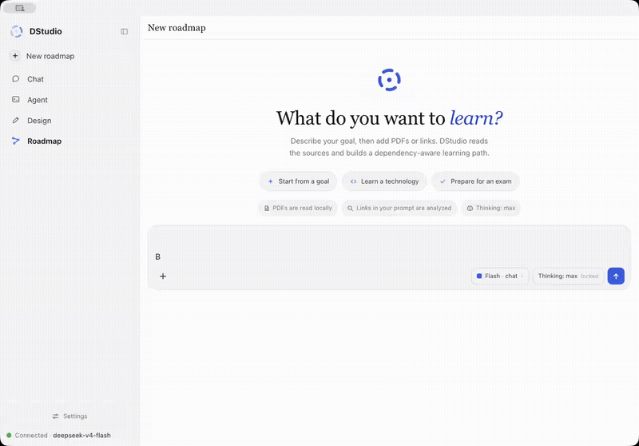
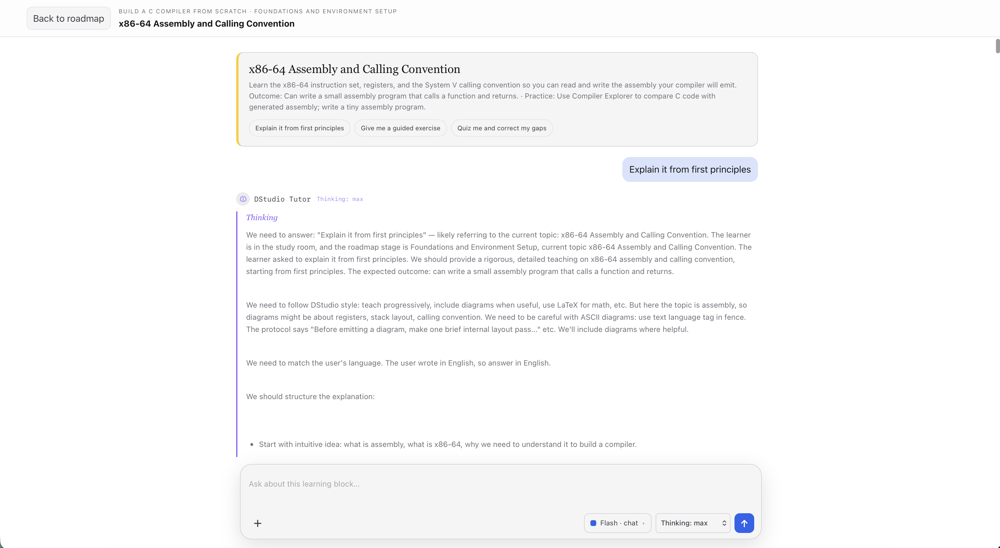
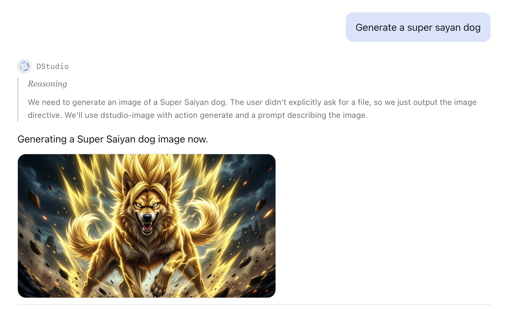
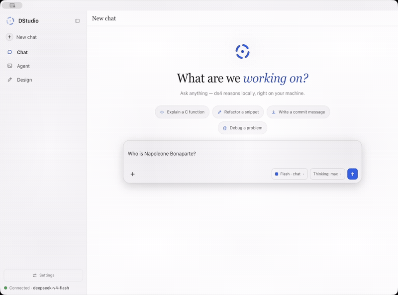
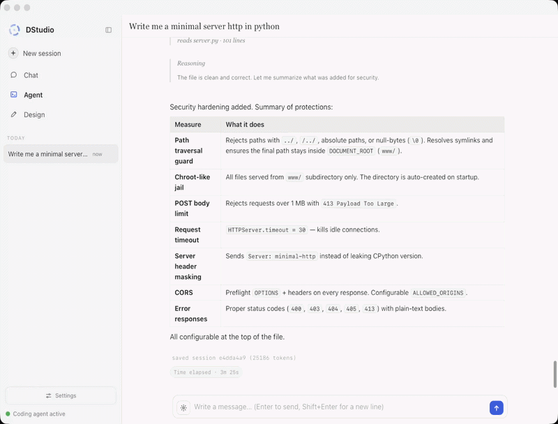
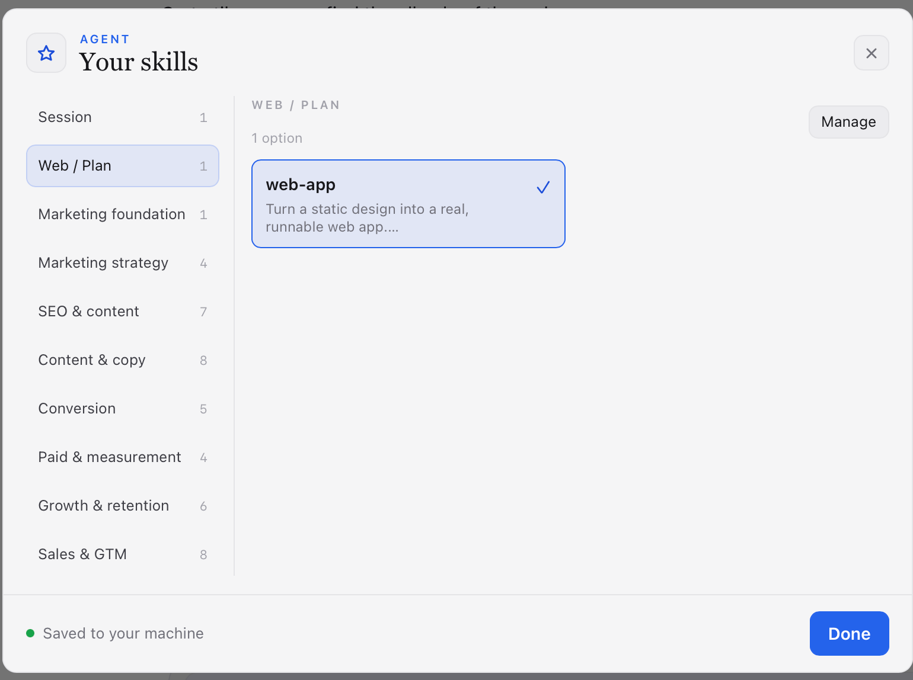
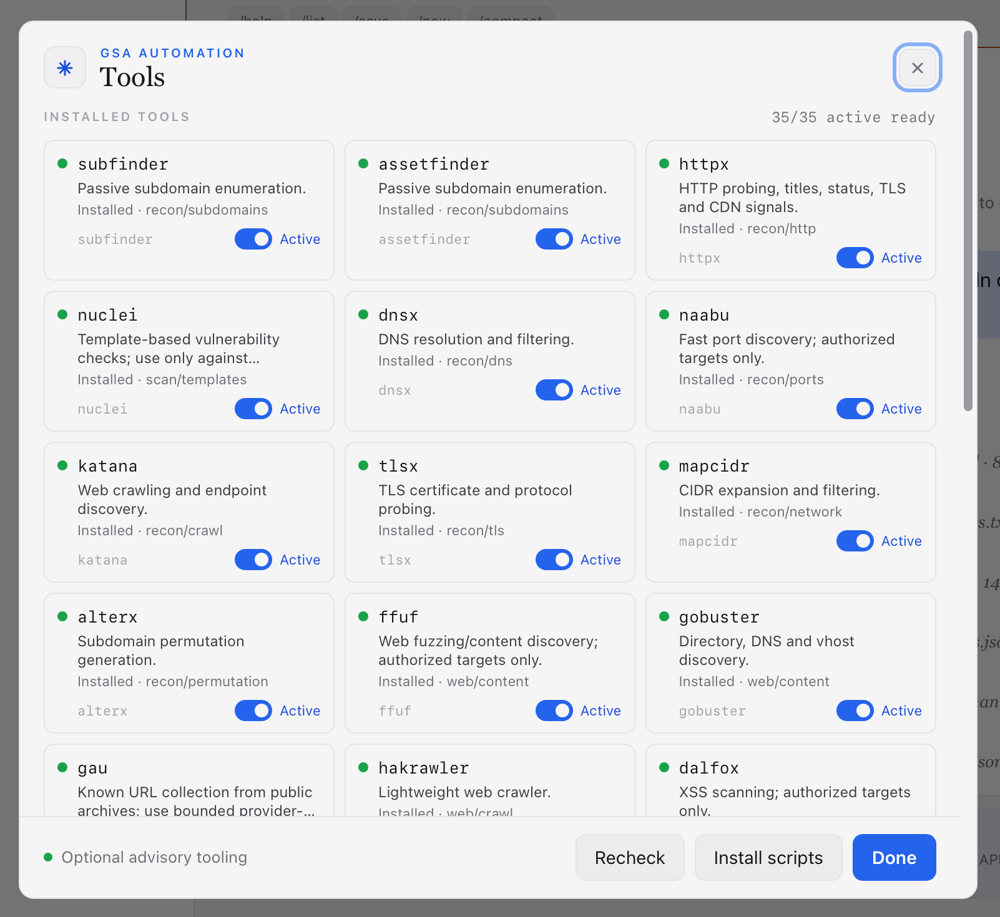

<div align="center">



# DStudio: Local AI Studio

**An open-source, local-first workspace for DeepSeek V4, GLM 5.3 Flash, Laguna S 2.1 and Qwen: private chat, coding and knowledge-work agents, document research, visual design, images and MiniMax H3 video. Three bundled inference engines (ds4, llama.cpp, MLX), DStudio's own agents plus pi and OpenCode. A cloud account is optional.**


</div>

## Contents

- [Current status: what works today and what does not](#current-status-october-3-2026)
- [Install](#install)
- [Supported models and limitations](#supported-models-and-limitations)
  - [Qwen3.6 and Qwen3.8-27B on llama.cpp](#qwen36-and-qwen38-27b-on-llamacpp)
  - [Qwen3.6 on MLX (Apple Silicon)](#qwen36-on-mlx-apple-silicon)
  - [Downloading models](#downloading-models)
- [Harnesses: every engine with every agent loop](#harnesses-every-engine-with-every-agent-loop)
- [What DStudio can do](#what-dstudio-can-do)
- [Modes](#modes): [Chat](#chat), [Learn](#learn--interactive-learning-paths), [Search](#search--deep-research), [Agent](#agent), [Cowork](#cowork), [Design](#design-a-local-design-studio)
- [Measured results](#latest-measured-results)
- [Requirements](#requirements)
- [Development and tests](#development-and-tests)
- [Network access](#network-lan) · [How it works](#how-it-works) · [Security](#security)
- [WIP checklist](#wip-checklist--october-3-2026)
- [Project layout](docs/PROJECT_LAYOUT.md)

DStudio is one desktop application for local AI. It runs large open-weight
models on your own machine and puts them behind a single interface: private
**Chat**, **Learn** paths with a Tutor, **Agent** (with Plan, GSA and RSA
workflows), document-focused **Cowork**, a **Design** studio, local image
understanding/generation/editing and optional MiniMax H3 video. Model
execution, project files and generated artifacts stay under your control.

Under the interface DStudio owns three inference engines and picks the right
one for the model you choose:

- **[ds4](https://github.com/antirez/ds4)**, antirez's native engine, for
  DeepSeek V4/V4.1, GLM 5.3 Flash, Laguna S 2.1 and Qwen3.8-Flash-Next;
- **[llama.cpp](https://github.com/ggml-org/llama.cpp)** for Qwen3.6-35B-A3B
  and Qwen3.8-27B;
- **[MLX](https://github.com/ml-explore/mlx)** for Qwen3.6-35B-A3B on Apple
  Silicon.

Their sources ship inside this repository and are built or installed offline;
setup never clones an engine. Agent mode can use DStudio's own agent or the
third-party **pi** and **OpenCode** harnesses, with any of those engines.

On macOS DStudio ships as **DStudio.app** (double-click, no Terminal); on
Windows as a portable folder. The UI is a single vanilla `index.html`
embedded in a small C launcher: no Electron, no framework build, no CDN and no
telemetry. Network access is explicit: model and harness-dependency downloads,
Web Search/Research and the optional DeepSeek API backend are the documented
outbound paths, used only when you request or configure them.

## Current status (October 3, 2026)

**This is an in-progress source tree, not a qualified release.** The latest
downloadable release, [DStudio 1.1.0](https://github.com/sk8erboi17/DStudio/releases)
(September 1, 2026), predates everything in this section. To use it today,
[build from source](#build-from-source).

**What changed since that release**

- **Qwen moved to bundled engines.** Qwen3.6-35B-A3B and Qwen3.8-27B run on
  llama.cpp `b11371`; Qwen3.6 also runs on MLX on Apple Silicon. The former
  Qwen side engines (vagrillo/ds4 and Ninnix/q36) are retired. Qwen3.8-Flash-Next
  runs on ds4 main.
- **Every mode on every engine.** Chat, Agent, Cowork and Design work on ds4,
  llama.cpp and MLX models alike. Design talks to the llama.cpp/MLX models with
  structured tool calls, and files being written stream live in every mode and
  harness.
- **pi and OpenCode inside DStudio.** Settings → Harnesses lets Agent mode run
  [pi](https://github.com/earendil-works/pi) or
  [OpenCode](https://github.com/anomalyco/opencode) instead of DStudio's agent,
  with the same model, workspace and transcript. DeepSeek works with both
  (pi through [pi-ds4](https://github.com/mitsuhiko/pi-ds4)).
- **One owner for local servers.** DStudio starts `llama-server` and the MLX
  server itself, marks them ready only when they report exactly the model you
  chose, and stops them on Stop, model switch, quit or crash.
- **Linux and Windows prepared** for llama.cpp the way Ollama builds it
  (CPU variants plus CUDA, ROCm or Vulkan when installed). Compiled, **not run**
  on those systems yet.
- Earlier in this cycle: Open IDE and Open Blueprint for Agent, live Design
  building in the IDE, 25 offline Design systems, automatic Task Graph checks,
  goals and mid-turn context, PDF source checking and faster PDF reading.

**Checked with real weights on an Apple M2 Max (96 GB)**

| What ran | Result |
| --- | --- |
| DStudio's own modes on Qwen3.6 (llama.cpp): Agent, recall, Cowork, Design, Chat with thinking on/off, no leftover server after a killed host | **6/6** |
| The same six checks on Qwen3.8-27B (llama.cpp) | **6/6** (Design took 37 minutes with thinking on) |
| The same six checks on Qwen3.6 (MLX) | **6/6** |
| pi and OpenCode × {Qwen3.6 llama.cpp, Qwen3.6 MLX, Qwen3.8-27B, DeepSeek V4 Flash}, three independently checked tasks each | **24/24** |
| `make check-fast` (model-free gate) and the macOS bundle smoke test | pass |

Failed runs that led to fixes are kept, not replaced: see
[docs/HARNESSES.md](docs/HARNESSES.md) and [tests/README.md](tests/README.md).
These are focused development checks, not a quality score or a ranking.

**Not done yet**

- Disk-session checkpoints for the llama.cpp/MLX models (chat history is saved;
  the engine session is not restored).
- The 100-task quality corpus has not been rerun on llama.cpp/MLX; the published
  Qwen scores were measured on the retired engines.
- Linux, Windows, CUDA, ROCm and Vulkan have not been run. pi and OpenCode are
  not available on Windows.
- pi/OpenCode were not run with GLM, Laguna, Qwen3.8-Flash-Next, DeepSeek V4.1
  or a cloud endpoint, nor with Plan, GSA or RSA.
- Learn/Tutor, PDF/vision, long tasks, the native desktop matrix, generated
  Design projects and final release admission. See the
  [WIP checklist](#wip-checklist--october-3-2026),
  [remaining work](docs/WORK_IN_PROGRESS.md) and [PLAN.MD](PLAN.MD).

## Install

### macOS release

Download the Apple Silicon zip from [GitHub Releases](https://github.com/sk8erboi17/DStudio/releases), extract it and move **DStudio.app** to Applications. The app is ad-hoc signed but not Apple-notarized (notarization requires a paid Apple Developer account), so Gatekeeper may warn that Apple cannot verify it. To open it the first time:

1. **Right-click** DStudio.app → **Open** → **Open** in the confirmation dialog, or
2. [**System Settings → Privacy & Security → Open Anyway**](https://support.apple.com/guide/mac-help/mh40616/mac), or
3. from Terminal: `xattr -cr /Applications/DStudio.app` (clears the download quarantine).

**Easiest install** — downloads the release, verifies its SHA-256, removes the
download quarantine and installs to `~/Applications`:

```sh
bash <(curl -fsSL https://raw.githubusercontent.com/sk8erboi17/DStudio/main/scripts/install-macos.sh)
```

Or open the DMG from the release and drag **DStudio.app** into Applications.

> The current release (1.1.0) does not include the llama.cpp, MLX and harness
> changes described above. Build from source for those.

### Build from source

```sh
make
open DStudio.app        # macOS
# or: ./dstudio         # Linux / headless
```

`make windows` produces the portable Windows x64 folder; run `DStudio.exe`.

### First launch

The first-run screen installs the pinned `ds4` engine into
`~/Library/Application Support/DStudio` (copied from the bundled sources and
compiled locally), then offers the supported models with their real download
sizes. A local system check covers the engine, selected model, Chat and
Agent/Cowork/Design runtimes, Cowork's Office helper, Web Search and network
state; each missing piece has a direct **Choose**, **Download**, **Install**,
**Start** or **Settings** action. Engines, models, harnesses and optional tools
stay outside the signed app, so updating or moving `DStudio.app` does not
delete them.

llama.cpp is built the first time you start a Qwen3.6 or 27B GGUF (about a
minute and a half on an M-series Mac; CMake required). MLX is installed the
first time you start or download the MLX model (about 15 seconds; macOS 26 and
Python 3.12–3.14 required). Both happen offline, in the background.

The regular `chat-v2` Flash GGUF and the similarly sized community
**abliterated** Flash GGUF are separate models. DStudio does not describe the
latter as universally “uncensored”: its
[model card](https://huggingface.co/apetersson/DeepSeek-V4-Flash-0731-Abliterated-DS4-Headroom128)
calls it an experimental refusal-direction edit with refusal-removal validation
still pending.

## Supported models and limitations

**Listed here means integrated, not equally tested.** “All four modes” means
Chat, Agent, Cowork and Design. You pick a model; DStudio picks its engine.
There is no engine or branch selector.

| Model | Engine | Modes | Size and important limits |
| --- | --- | --- | --- |
| DeepSeek V4 Flash | ds4 main | All four | ~87 GB. Standard checkpoints are text-only; the optional abliterated variant is experimental. |
| DeepSeek V4 Flash Vision-Exp | ds4 main | All four, with images | Experimental; needs its matching vision encoder. |
| DeepSeek V4 Pro | ds4 main | All four (integrated) | About 430 GB; not validated on the reference 96 GB Mac. |
| DeepSeek V4.1 Flash | ds4 main | Experimental; qualification in progress | macOS Metal, full power. Q2 is 365.7 GB on SSD including disk-backed Engram tables; no DSpark or non-Metal qualification. |
| GLM 5.3 Flash | ds4 main | All four; images with its encoder | ~96.5 GB Q2. Full-model QA of the M2 optimization remains open. |
| Laguna S 2.1 | ds4 `laguna-s2.1` | All four, text only | Experimental, macOS Metal; needs resident weights (no forced SSD streaming). |
| Qwen3.8-Flash-Next | ds4 main | Experimental Chat, Agent, Cowork | Single-file Q2 (147.2 GB) or Q4 (177.3 GB); old base + PLE files are incompatible. Design and vision unqualified. |
| Qwen3.6-35B-A3B | llama.cpp | All four, text only | 31.8 GB Q6_K_XL. Real workflows and a Design page pass. No disk checkpoints. |
| Qwen3.6-35B-A3B (MLX) | MLX | All four, text only | 36.7 GB MXFP8 folder; Apple Silicon with macOS 26. Real workflows and a Design page pass. No disk checkpoints. |
| Qwen3.8-27B | llama.cpp | All four; images in Chat, Agent and Cowork | 25.3 GB Q6_K_XL + 0.93 GB projector. Real workflows pass; Design is slow (37 min on an M2 Max with thinking on). Learn and PDF workflows unqualified. |

Separate media workers provide **Ideogram 4** image generation,
**HunyuanImage 3** image editing and **MiniMax H3** video; they are not chat
models. A remote OpenAI-compatible or DeepSeek API endpoint can replace local
inference while every tool keeps running locally.

**Memory modes.** ds4 launches default to expert **SSD streaming Off**; Metal
keeps the whole model resident when it fits and otherwise uses the engine's lazy
memory-mapped path. DStudio never lowers your context to force residency. **On**
remains an explicit option for compatible models. llama.cpp and MLX keep all
weights in memory and have no expert streaming; Qwen3.8-Flash-Next keeps its
backbone in RAM and reads its BF16 n-grams from SSD. Image, editing and video
workers are one-shot: DStudio evacuates the chat model before loading one and
restores it afterwards.

### Qwen3.6 and Qwen3.8-27B on llama.cpp

Both checkpoints run on **llama.cpp** `b11371` (`99b9548`), shipped in
[`src/engines/llama.cpp`](src/engines/llama.cpp/). DStudio builds `llama-server`
from those sources the first time you start one of them, without the network,
and reuses the build afterwards. The weights live in the shared `ds4/gguf/`
folder.

DStudio starts the server, checks that it really loaded the model you chose
(path, context, build and image projector) before marking it ready, and stops
it when you switch models, press Stop or quit. If DStudio crashes, a small
guard process stops the server too, so tens of GB are not left in memory.
Chat, Agent, Cowork and Design share the loaded model: switching between them
does not reload it.

- **Thinking** is one switch, on or off; there is no separate Max level.
  Agent and Cowork use Qwen's published sampling (thinking on: temperature 0.6,
  top_p 0.95; off: 0.7, 0.8).
- **Design** receives its tools as structured function calls; Qwen did not
  follow Design's DSML text protocol reliably.
- **Not available:** power throttling, expert SSD streaming, DSpark, prompt
  lookup, and disk checkpoints (the tools reach the model through DStudio's
  model RPC and hold no engine session to save). Chat history is saved and the
  running server reuses its live prompt cache.
- **The 27B** needs its matching F16 projector; DStudio downloads and checks
  both files and admits images in Chat, Agent and Cowork.

On October 3, 2026 a real run through the production host passed **6/6 on each
model**: an Agent turn computes a generated CSV total with real tool calls and
writes it, recalls a fact from a workspace file, Cowork writes a document,
Design saves a page with the exact requested heading, Chat answers with thinking
on and off, and a killed DStudio leaves no server behind. Retained failures
include a thinking-off arithmetic error (Qwen3.6) and the 27B Design run that
hit the test's former one-hour bound before finishing.

### Qwen3.6 on MLX (Apple Silicon)

On Apple Silicon with macOS 26, Qwen3.6-35B-A3B can also run on **MLX**,
Apple's machine-learning framework, from the MXFP8 folder
`mlx-community/Qwen3.6-35B-A3B-mxfp8`. MLX ships as verified PyPI wheels
(mlx 0.32.3, mlx-lm 0.32.0) in [`src/engines/mlx`](src/engines/mlx/): nothing is
compiled or fetched. The first start installs them offline into a private
Python environment (Python 3.12–3.14 must be installed, for example from
Homebrew); a later Python upgrade that removes the old version triggers a
reinstall instead of a broken launch.

Download the weights from **Settings → Models** (*Qwen3.6-35B-A3B · MLX
MXFP8*, 36.7 GB) or with `./download-model.sh qwen36-mlx`; each of the 20 files
is checked against its pinned SHA-256 and transfers resume after Stop. If you
already have this folder, link it as `ds4/mlx/Qwen3.6-35B-A3B-mxfp8`; DStudio
checks it and never copies or moves it.

It behaves like the llama.cpp models: one server owned by DStudio, shared by all
four modes, ready only when it reports exactly the folder you chose, stopped on
Stop, model switch, quit or crash. Two small versioned patches make the MLX
server serve only that model and report its reasoning in the field DStudio
reads ([patch notes](patch/README.md)). MLX has no expert streaming and no disk
KV cache. It is not available on Intel Macs, older macOS, Linux or Windows; use
the GGUF there.

The October 3 real run passed **6/6**. Three earlier failed runs are kept with
their fixes (a folder not recognized as a model, an HTTP/1.0 readiness reply,
and a 512-token default reply limit plus a renamed reasoning field) in
[tests/README.md](tests/README.md#qwen36-on-mlx-apple-silicon).

### Qwen3.8-Flash-Next on ds4 main

Flash Next shares ds4 main (pinned at
[`0aaea5a`](https://github.com/antirez/ds4/commit/0aaea5a238fb41a35106a551e73c8409dfb751ac));
there is no separate engine to install. Download the single-file **Q2
(147.2 GB)** or **Q4 (177.3 GB)**: each includes the original BF16 n-grams read
from SSD, with the backbone resident in Metal memory. The older base + PLE
files stay on disk but are not compatible and are not converted. It exposes
experimental Chat, Agent and Cowork with its native tool format; Design and
vision remain unavailable. The Q4 baseline answered 75/100 corpus questions and
8/8 long-context cases; wrong answers stay in the denominator. See the
[migration report](docs/QWEN_NEXT_MAIN_MIGRATION.md) and the
[Qwen checkpoint](docs/QWEN_CHECKPOINT.md).

### DeepSeek Vision-Exp, GLM 5.3 and Laguna

- **DeepSeek V4 Flash Vision-Exp** is a separate language checkpoint, not an
  encoder for the older 0731 GGUF. Choose *Vision-Exp · IQ2_XXS* (~86.7 GB plus
  its 0.93 GB encoder), mixed Q2/Q4 (~97.6 GB) or MXFP4 (~156 GB). DStudio
  passes `--vision` automatically; Chat sends image blocks directly, Agent and
  Cowork use ds4's `view_image`, Design inspects pixels natively. Its own DSpark
  support file is `ds4f-vision-dspark`; if model, DSpark and context exceed the
  estimated Metal budget, DStudio explains the risk and asks before launch.
- **GLM 5.3 Flash** runs on ds4 main with the same binaries and model store.
  The optional native encoder (`glm53-vision`, ~1.13 GB) enables images in all
  modes. `--power` is dropped (unsupported by GLM). With SSD streaming on,
  DStudio uses the full-layer prefill path and a 32 GB expert cache; the macOS
  build includes the [M2 Max decode patch](patch/ds4-glm53-m2max/README.md),
  whose full-model QA is still open.
- **Laguna S 2.1** runs on ds4's pinned `laguna-s2.1` branch in
  `./ds4-laguna-s21`, sharing `./ds4/gguf`. The ~68 GB Q4_K_M download has
  Stop/Resume and **Delete partial**. It is macOS Metal-only, text-only and
  needs full residency; image drops are rejected rather than routed elsewhere.

### Downloading models

Every download is real, large and resumable, and every model lands in the
shared `./ds4/gguf/` store (the MLX folder in `./ds4/mlx/`). Settings → Models
shows engine preparation, transfer and verification separately; Stop keeps
partial data for Resume, and a download never changes your selected model.
From the project root:

```sh
./download-model.sh --help
./download-model.sh ds4f-q2        # DeepSeek V4 Flash
./download-model.sh ds4f-vision-q2 # DeepSeek V4 Flash Vision-Exp + encoder
./download-model.sh ds41f-q2       # DeepSeek V4.1 Flash Q2 (needs hf with Xet)
./download-model.sh glm53-q2       # GLM 5.3 Flash (glm53-vision for its encoder)
./download-model.sh laguna-q4      # Laguna S 2.1
./download-model.sh qwen38-q2      # Qwen3.8-Flash-Next Q2 (qwen38-q4k for Q4)
./download-model.sh qwen36-q6      # Qwen3.6 Q6_K_XL, 31.8 GB, llama.cpp
./download-model.sh qwen27-q6      # Qwen3.8-27B + projector, 26.2 GB, llama.cpp
./download-model.sh qwen36-mlx     # Qwen3.6 MXFP8 folder, 36.7 GB, MLX
```

DeepSeek V4, GLM and Laguna show a visible `<model>.gguf.part` while a transfer
is incomplete. The pinned Qwen downloads verify size and SHA-256 per file before
the model becomes selectable. Hugging Face/Xet transfers (Qwen3.8, V4.1) keep
partial data in the Hugging Face cache until they are verified in full.

### Linux and Windows (prepared, not tested)

On Linux and Windows DStudio builds llama.cpp the way Ollama does: one server
plus a loadable module per backend. Every CPU variant is built and llama.cpp
picks the best one for the processor; CUDA, ROCm and Vulkan modules are added
when their toolkit is installed (`DSTUDIO_LLAMA_BACKENDS` can request or limit
them). Layers go to the GPU memory that is actually free, the rest to the CPU;
your context setting is never lowered. On Windows the server runs inside a Job
Object, so it stops with DStudio. This code is cross-compiled for Linux and
Windows, and the same dynamic build layout was built and run for real on macOS
with a correct Qwen3.6 answer, but it has **not** been run on Linux, Windows,
CUDA, ROCm or Vulkan. ds4 itself must be built for your platform; MLX and the
pi/OpenCode harnesses are not available on Windows.

## Harnesses: every engine with every agent loop

A *harness* is the agent loop around a model: it decides which tool to call,
runs it and feeds the result back. DStudio's own harnesses (Agent, Cowork,
Design, GSA and RSA) live in [`src/harness/`](src/harness/), next to pinned
source snapshots of **pi**, **OpenCode** and **pi-ds4**.

Choose **Settings → Harnesses → Agent harness**: *DStudio*, *pi* or *OpenCode*.
The next Agent launch keeps the same model, engine, context and workspace; only
the loop changes. The transcript, diff cards, Stop, Task Graph receipts and the
saved conversation work as before. pi comes in two forms, chosen from the
model: **pi-ds4** when ds4 serves it (DeepSeek, GLM, Qwen Next, Laguna) and
plain **pi** with llama.cpp, MLX or a remote endpoint.

| Harness | DeepSeek and other ds4 models | Qwen3.6 / 27B (llama.cpp) | Qwen3.6 (MLX) | Remote endpoint |
| --- | --- | --- | --- | --- |
| DStudio Agent, Cowork, Design | yes | yes | yes | yes |
| pi | yes, through pi-ds4 | yes | yes | yes (not run live) |
| OpenCode | yes | yes | yes | yes (not run live) |

- **Install.** Settings → Harnesses → **Install** (or
  `python3 scripts/install-harness.py --root <install root> --harness pi|opencode`).
  The sources ship with DStudio; their JavaScript dependencies do not. This one
  explicit step downloads them, pinned by each project's lockfile (Node and npm
  required; OpenCode also uses a private Bun 1.3.14), applies DStudio's
  versioned patches and builds in a private folder. About 3 minutes for pi and
  6 for OpenCode on an M2 Max. Launching afterwards is offline.
- **How it connects.** A small bridge speaks DStudio's runtime protocol and
  gives the harness one loopback model endpoint protected by a per-process
  token. Behind it: the host's model RPC for llama.cpp, MLX and remote models
  (the harness never sees an API key), or a `ds4-server` the bridge starts for
  ds4 models. The endpoint applies DStudio's model identity, sampling and
  thinking choice.
- **Confinement.** pi always loads a guard that blocks file tools outside the
  workspace (real paths, so a symlink cannot escape); OpenCode runs with
  external directories denied and a patch that makes the workspace itself, not
  its enclosing git repository, the boundary. Shell commands are not sandboxed
  in any harness, including DStudio's own.
- **Streaming.** Text, reasoning and tool calls stream as they are generated:
  a file being written appears in the transcript and in Open IDE while the
  model writes it, in every harness and on every engine. The executed call is
  still the validated complete one.
- **Offline and private.** pi runs with `--offline` and no telemetry; OpenCode
  runs with its model-catalog fetch, auto-update, sharing, LSP downloads and
  external skills disabled, in a private config directory.
- **Limits.** pi and OpenCode replace Agent mode only; Cowork and Design keep
  DStudio's tools. Mid-turn steering is not forwarded to them, their sessions
  live in memory while the Agent runs (DStudio still saves the transcript), and
  very long sessions can exceed the model RPC's 32,768-token request validation.

Results, process ownership, patches and the full list of what was not run:
[docs/HARNESSES.md](docs/HARNESSES.md).

## What DStudio can do

- Run **DeepSeek V4/V4.1, GLM 5.3 Flash, Laguna S 2.1 and Qwen** locally through one native interface and model picker; DStudio selects ds4, llama.cpp or MLX for you.
- Use a **private AI chat** with reasoning display, prefix-cache reuse, citations from optional Web Search and local history.
- Use **Learn** to build an interactive learning path from a goal, PDFs and links, and open a dedicated **Tutor** for any block.
- Run **Web Search or Deep Research** through DStudio's local browser helper, with read-page evidence and source cards.
- **Check PDF sources**: open the cited page with the quoted words highlighted and recheck simple calculations.
- Send image pixels directly to **DeepSeek V4 Flash Vision-Exp**, **GLM 5.3 native vision** or **Qwen3.8-27B**; generate images with **Ideogram 4 FP8**, edit them with **HunyuanImage 3 NF4**, and create video with the optional **MiniMax H3** pipeline.
- Use a **local coding agent** that reads, edits and verifies files in a folder you choose, with an **Open IDE** view, **Open Blueprint** code maps and automatic Task Graph checks; or run **pi** or **OpenCode** as the agent loop.
- Use **Cowork** for source-grounded spreadsheet, PDF, document and presentation work with native Office tools and no arbitrary shell.
- Toggle **Plan** for a Markdown execution plan, keep working towards a saved **/goal**, and add context while a turn runs.
- Create **Skills**: private instruction packs for Agent, Cowork and Design.
- Run **Guided Security Analysis (GSA)** for authorized reviews or **Reverse Structure Analysis (RSA)** for public websites.
- Generate and refine complete interfaces in **Design**, with 25 offline design systems, measured layout checks and export.
- Use an optional **DeepSeek API** or remote endpoint for inference while all tools keep running locally, and reach the UI from another device on your LAN.

## Modes

A sidebar switches between Chat, Agent, Cowork, Design and Learn. Plan, GSA and
RSA are Agent workflows; Tutor rooms live inside Learn; image and video
generation are routed from Chat and Design. Every mode has reopenable local
history. Restorable on-disk engine sessions depend on the engine: ds4 models
have them, the llama.cpp and MLX Qwen models do not yet.

### Chat

<div align="center">



</div>

Streaming chat backed by the selected local model: context lives in the
engine's cache (prefix reuse is shown as *cached* tokens) and every message is
saved locally. You get live tokens/s, collapsible reasoning, native MathML for
LaTeX, syntax-highlighted code, file artifacts, image/PDF attachments and
optional Web Search sources. A configured DeepSeek API key or remote endpoint
can replace local inference without moving DStudio's workspace tools into the
cloud.

The composer model picker has search, quantization/size details and the current
model highlighted. Choose a model and DStudio selects its engine automatically.
Download progress stays in Settings → Models.

With DeepSeek Vision-Exp or GLM 5.3 and the matching encoder installed, image
attachments stay multimodal: DStudio sends PNG/JPEG pixels to the engine; Agent
and Cowork use ds4's `view_image`, and Design uses its native `see_image`.
Qwen3.8-27B reads images through its own projector on llama.cpp. There is no
text-description detour or secondary visual model. Text-only models (older
DeepSeek checkpoints, Laguna, Qwen3.6) expose no image tools and read only PDF
text layers.

#### Check PDF sources

For newly read PDF attachments in local Chat, DStudio adds a source-checking workflow inspired by [NanoIndex](https://github.com/NanoNets/nanoindex):

- **See where a quotation comes from.** Click a PDF citation in the answer to open the original physical page, with the exact words highlighted. Zoom in for small text or tables.
- **Handle repeated references.** If the model uses `[P1]` for several passages, the modal lets you choose the intended passage instead of guessing. Identical entries are merged. Internal evidence JSON is hidden, including malformed output; unreadable source details show an explanation, not a verification badge. Saved replies are reparsed too.
- **Know when a source cannot be located.** Missing or repeated quotations are reported without selecting a misleading highlight. An image-only page can be opened, but this feature does not run OCR.
- **Move around the document.** The attachment preview offers recognized numbered chapter/section headings, nested section hints and explicit “see section…” links. These are text-based hints, not a complete outline or a semantic knowledge graph.
- **Check the arithmetic.** “Check passages and calculations” first locates the cited passages, then recalculates supported sums, differences, products, ratios and percentages using the quoted numbers. It shows the operands, sources, rounding and any difference from the answer. It does not verify units, whether the right numbers were chosen, or the answer’s interpretation.

No extra model or cloud OCR service is added. Citations and calculations appear
when the answering model supplies the structured source information;
unsupported or malformed output is not silently marked as verified. Original
PDFs are kept in a local cache limited to **32 documents / 2 GiB**; source
identity is checked against the PDF bytes, and an evicted or changed original
must be attached again. This is **host-local on macOS/Linux** (not exposed to
LAN clients) and needs Poppler and `shasum` or `sha256sum`.
`make test-pdf-evidence` exercises real Poppler extraction/rendering, citation
matching, identity, calculations and the browser viewer with **no model
loaded**; it is an implementation test, **not a model-quality benchmark**.

#### Multimodal PDFs

<div align="center">



</div>

Attach a PDF and ask in any language. **When all its text fits, DStudio reads
it directly**: no extra model turn to choose pages and no embedding index to
build. All physical pages, extracted text, numbers and citation links are kept.
This applies to Chat, Learn attachments and Cowork.

Long PDFs, scans and uncertain text layers use the planner: the active model
decides whether to build a bounded overview, read exact physical pages or search
semantically. DStudio extracts text locally and uses the small pinned
**Qwen3-Embedding-0.6B only as a text embedding index**, never as a visual
router. With DeepSeek Vision-Exp or GLM 5.3 active, up to four selected pages
are rendered and sent to that model's native encoder. Text-only models receive
the extracted text and report any image-only pages they could not read.

`make test-pdf-complete` checks complete text against Poppler byte for byte,
fallbacks, real citation highlights and upload-to-Chat behavior with a
simulated answering model: it proves extraction and routing, **not answer
accuracy or a speed multiplier**. See [PDF reading](docs/PDF_READING.md).

### Learn — interactive learning paths

<div align="center">



</div>

Describe what you want to learn and optionally attach PDFs, notes or public
links. Every Learn path starts with mandatory Deep Research, even when the
prompt contains no link. Discovery tries Google first in DStudio's Chrome
session and falls back to Brave, Bing and DuckDuckGo when a search page blocks
it; every search page and selected source is opened through Chrome (CDP), and
dynamic pages are scrolled until their content stabilizes before extraction.
DStudio looks for authoritative curricula, current documentation, prerequisite
evidence, practical exercises, assessment criteria and common pitfalls; your
links and PDFs are included as evidence but never treated as the whole plan.
Only after at least five substantial pages from four independent hosts and
fifteen grounded curriculum facts does a semantic judge decide whether the
knowledge gaps are closed; failed browser reads do not count as progress.

The generated path records cross-topic prerequisites, key concepts, effort
estimates, observable outcomes, practice, mastery checks, stage objectives,
checkpoints and a final project. There is no preset topic catalogue or fixed
quota: a broad field becomes several stages or branches, a narrow skill stays
compact. A structural gate rejects shallow or truncated drafts; a separate
adversarial factual audit checks every stage and then the whole path, and only a
factually clean draft reaches the independent curriculum judge (coverage,
sequencing, granularity, practice, assessment, sources, capstone). Repairs are
audited again until both pass or you press **Stop**. The result opens as an
editable graph inspired by [roadmap.sh](https://roadmap.sh/): complete, reorder
or delete blocks, or add one and let the model write a coherent outcome and
exercise for it. The graph is saved with its history and exports as PNG, PDF or
JSON.

#### Study with a dedicated Tutor

<div align="center">



</div>

Every stage, topic and final project has a **Study** button that opens a
full-screen Tutor chat for that block. The Tutor already knows the goal, stage,
prerequisites, outcome, practice task and sources, so it can teach from first
principles, answer follow-ups, give guided and independent exercises, run
quizzes and correct your work. It keeps the normal Chat tools (Thinking, files,
PDFs and images, LaTeX, ASCII diagrams, hints, canvas previews). Each block owns
its transcript and attachments, so **Study** resumes the same lesson.

Learn generation and its verification roles use **Thinking: max**. Local ds4
needs at least 393,216 context tokens for Max, so DStudio temporarily launches
the Learn pipeline at that size when your Chat context is smaller, without
changing the saved setting. Learn has not been qualified on the llama.cpp/MLX
Qwen models.

### Local Image Generation

<div align="center">



</div>

Ask for an image in any language. DeepSeek Vision-Exp or GLM 5.3 interprets the
request and any source pixels, then emits an explicit `generate` or `edit`
directive. `generate` goes to Ideogram 4 FP8 with your image preset; `edit` goes
to the full, non-distilled HunyuanImage-3.0-Instruct model (NF4 so it fits the
96 GB reference Mac, with critical layers and compute in BF16, `think_recaption`
and 50 diffusion steps through Tencent's official implementation). Text-only
models cannot issue source-dependent edits.

The reply gets a placeholder immediately while DStudio reports real load,
reasoning, sampling and decode phases. Presets are explicit choices, never an
automatic downgrade. One lock serializes Ideogram, Hunyuan and H3, and the
media-memory lease evacuates a resident chat/Design model when required.
Generated files stay local and are attached to the conversation.

#### Image presets

Choose **Settings → Vision → Image preset**. It controls new Chat images,
generated video opening frames and new Design sessions; changing it does not
restart a model or alter a render in progress.

| Preset | Intended use | Generation steps | Landscape image (16:9) |
| --- | --- | ---: | --- |
| Low | Quick drafts and composition checks | 12 | 1024 × 576 |
| Medium | A balance of detail and waiting time | 20 | 1024 × 576 |
| High | More refinement at the same size | 48 | 1024 × 576 |
| MAX | A larger, natively generated image | 48 | 2048 × 1152 |

MAX preserves DStudio's previous default. Low, Medium and High use Ideogram's
Turbo-12, Default-20 and Quality-48 samplers; MAX uses Quality-48 at twice the
width and height, not an upscale. More steps or pixels do **not** guarantee
better prompt adherence.

Measured on an **M2 Max with 96 GiB**, with other apps left running:

| Preset | Classical illustration | Headphone portrait |
| --- | ---: | ---: |
| Low | 4m 31s | 6m 37s |
| Medium | 6m 51s | 10m 13s |
| High | 15m 46s | 24m 35s |
| MAX | 78m 01s | 123m 33s |

**These times include failed outputs.** All eight attempts finished, but only
four produced illustrations; the other four returned refusal-message images,
and the illustrations missed details of the brief. This small comparison does
not establish a quality winner or guaranteed waiting times.


[Full preset benchmark](extension/benchmarks/image-presets/README.md): every
original image, findings, exact settings and reproduction steps.

### Local Video Generation (MiniMax H3)

DStudio runs the downloadable MiniMax H3 weights through a pinned
[antirez/h3.c](https://github.com/antirez/h3.c) checkout: a native
C/Objective-C engine on Metal, MPSGraph and Accelerate, without ComfyUI or
PyTorch. Ask for a video in Chat; DStudio routes it to the one-shot executable,
optionally uses a recent image as the first frame, reports h3.c's real progress
and returns a locally streamed MP4. You can also ask for an opening image first
(Ideogram 4) and then animate it. No hosted generation API is used.

> **Work in progress — two-photo H3 references.** With MiniMax H3 selected, two
> attached images become ordered Ref2VA inputs (`<Picture 1>`, `<Picture 2>`).
> Settings has a separate preparation action for the official Ref2VA
> transformer (about **61.7 GiB / 66 GB** on top of FL2VA). This path has not yet
> completed end-to-end validation.

Open **Settings → Video** before the first generation, review the upstream
terms, confirm that your territory and use are authorized, then select
**Prepare local H3**. Setup compiles an immutable h3.c revision and downloads
only the official `FL2VA/` files (about **134 GiB / 144 GB**, resumable) into
`~/.dstudio/minimax-h3`. Three render profiles expose h3.c's controls:
**Quality** (default; all 50 blocks, no reuse, 768p-class), **Balanced**
(`--layers 45 --reuse 2`, ~512-class) and **Preview** (40/50 blocks, reuse 3,
upscaled). DStudio never switches profile on its own. M3 and older GPUs use the
portable BF16/MPS path; M5-class hardware can use Metal 4/TensorOps paths.

### Search & Deep Research

<div align="center">



</div>

Search runs through DStudio's local web helper, not a hosted browsing service.
**Web Search** plans targeted queries, reads the best pages, extracts facts and
answers with clickable citations. **Deep Research** runs a longer evidence loop:
classify the request, search, read primary sources, extract facts, judge
sufficiency, write a grounded report and keep the source cards.

Before delivering a Deep Research answer, DStudio checks it against the
collected evidence and the request; it can revise unsupported claims, missing
details or undisclosed disagreements, and counts explicit word limits. A failed
review is shown as an incomplete draft, not a verified result. The reviewer is
the local model too: it helps catch errors but cannot guarantee truth.

Relevant details can come from later page sections, and with an active native
vision model research can inspect real pixels of an image or chart (one
viewport per page, three captures per run). Search admits up to 6 queries and 8
page reads; Deep Research up to 18 queries, 24 reads and 12 follow-up actions.
There is no application elapsed-time cutoff on discovery, writing or review: a
slow valid local-model request continues until it completes, fails or you press
Stop. [Measured scope and limits](extension/search/bench/README.md).

### Agent

<div align="center">



</div>

Agent is a local coding agent: it reads and edits files, runs commands inside a
working directory you choose, streams its answer while it works, folds private
reasoning into a **Thought** disclosure and groups tool calls into a compact
action timeline. The header shows the mode, model and working folder;
`/help`, `/list`, `/save`, `/new` and `/compact` are available below the
composer. A post-edit verifier catches common syntax errors so the model can
repair them in the same turn. By default this is DStudio's own agent;
[pi or OpenCode](#harnesses-every-engine-with-every-agent-loop) can run instead.

**Open IDE.** The header's **Open IDE** replaces the conversation with a VS
Code-style view of the working folder: file tree, tabs, a syntax-highlighted
editor and a terminal panel with the agent's `bash` commands and output. While
the agent writes a file, a cursor labelled with the active model shows the text
as it is generated and **Follow** keeps the editor on that file. While the model
reasons, a thought bubble shows the newest words of that reasoning. Streamed
text is marked *not on disk yet* until the tool finishes and the IDE re-reads
the file. After the turn you can edit and save (⌘S); DStudio refuses the save if
the agent started again or the file changed on disk, and asks which version to
keep. Limits: UTF-8 text up to 2 MB, links open read-only, not available on
Windows yet; runtimes that do not stream tool results show the files when the
turn ends.

**Open Blueprint.** Turns the working folder into interactive diagrams the
Agent maps from the code: **Architecture**, **Workflow**, **Sequence**,
**Data flow** or **Lifecycle**, optionally focused on a question. The Agent
writes a typed blueprint (`dstudio.blueprint/1`) to `.dstudio/blueprints/`,
citing a file, a line range and a quoted line for every node and relationship.
DStudio checks every citation against the file's bytes and shows how many claims
are backed; click a node for its evidence, **Trace** what it reaches, find a
**Route** between nodes, search with `/`, open a citation in the IDE, and
**Export** HTML, SVG or JSON. **Send to Design** starts Design in a `design/`
folder with the blueprint attached; **Implement code** asks the Agent to build
what the blueprint describes, in dependency order, running the build and tests
after each group. The check proves that quoted lines exist, not that the model
described the behaviour correctly. The idea follows
[Archify](https://github.com/tt-a1i/archify) (MIT); no Archify code is included.

Thinking defaults to **high**. Selecting **max** below ds4's 384k-token
threshold explains the required context and estimated memory cost before
restarting; declining changes nothing.

**Prompt lookup (experimental, ds4 Chat / Agent / Cowork).** The managed ds4
runtimes can reuse text already in the conversation as candidate output,
checked by the same model. It helps when copying or preserving existing text;
it does not invent new answers faster. Normal generation stays the default;
accelerated batching is opt-in. [Modes and tests](patch/ds4-agent-jsonl/PLD.md).

#### Prompt lookup: real-engine results

**The clearest benefit was in Chat; it was not a general Agent speedup.** The
actual DeepSeek V4 Flash engine ran on an M2 Max with 96 GB, **Minecraft left
running and SSD streaming off**: 78 tasks (13 cases × 3 modes × 2 repetitions).
Faster but incorrect results did not count.

| Workspace | Checks passed in each mode | Experimental PLD vs disabled, in this run |
|---|---:|---|
| Chat | 14/14 | **2.84× observed speed**, comparing the same correct outputs |
| Agent | 6/6 | **About the same overall**; long copies helped, new code did not |
| Cowork | 2/6 | No useful overall conclusion: document-fidelity failures remained |

<div align="center">
  
</div>

Median Chat copy time fell from **30.0 to 12.3 seconds**; an Agent file copy
from **86.0 to 75.0 seconds**, while a small edit stayed around **36.7 seconds**
and a new function became slower (**21.8 to 28.3 seconds**). **66/78 checks
passed**: the 12 failures were the same Cowork copy cases in every mode (a lost
final newline). [Method and per-task results](extension/prompt-lookup/bench/README.md) ·
[data](extension/prompt-lookup/bench/results/2026-09-05-m2-max-minecraft-no-ssd.json).

### Cowork

Cowork turns the selected local model into a knowledge-work partner for a
folder of real files. It reads PDF, DOCX, PPTX, ODT, RTF, Markdown and text;
inspects, reads and writes XLSX, CSV and TSV; creates verified documents,
paginated PDFs and 16:9 presentations; and reopens its outputs before reporting
completion. Uploaded names are sanitized, macro-enabled formats are rejected,
writes are atomic and file access is confined to the workspace, including
symlink and traversal checks.

The Office bridge is a small standard-library Python helper invoked with a
bounded JSON request; there is no command shell or arbitrary Python in Cowork.
Spreadsheet and document text is framed as untrusted source content, so
embedded instructions are not treated as tasks. Cowork uses the context size
from Settings and the same conversation surface, Thinking view and action
timeline as Agent.

Cowork can also turn several documents into a **source-backed comparison
table**, for example “Compare these course programs by topic, duration and
prerequisites.” Each cell can show its original excerpt, file and page; missing
and conflicting values stay explicit; sources are rechecked on inspection and
export (expandable HTML or an Excel workbook with data, status and evidence
sheets). A source match confirms the quote and value occur in the document, **not
that the interpretation is correct**. Limits: text-layer PDFs and Office/text
sources, no OCR, up to 200 rows, 32 columns and 64 files.
[Document-table tests](tests/unit/document_table_test.py) exercise real files
without a model; they are not an extraction-accuracy benchmark.

### Skills: local task recipes

<div align="center">



</div>

Create a recipe, pick it, and the next Agent, Cowork or Design turn inherits its
workflow, constraints and quality bar without restarting the model. There is no
skill marketplace: every skill is a local Markdown pack written by you, stored
in your user data directory and injected only when selected. GSA and RSA use
their own deterministic phase templates instead.

### GSA: guided security analysis

<div align="center">



</div>

GSA gives the Agent a security-analysis operating mode. Open **RSA/GSA** beside
**Open IDE**, choose **GSA**, describe an **authorized** mission and optionally a
target URL. The run goes through **selection** (files and hypotheses),
**preflight** (evidence, trust boundaries, safe checks), **validation**
(concrete proof with bounded scripts or optional local tools) and **report**
(verdict, sources, limits, next actions). Security profiles distinguish passive,
blue-team, explicitly authorized red-team and purple-team work; authorization is
never inferred from the prompt. External tools are listed, can be disabled and
have their invocations, parameters and output recorded verbatim; **Install
missing** runs a supervised background installer. Each phase is committed
through a structured control call validated by the host, and a slow evidence
collector is not killed as idle. See the [GSA/RSA workflow](docs/workflow-ui.md).

**RSA** is the non-security reverse-structure workflow: it inventories a public
site's visible routes and assets, captures ordinary browser evidence and writes
`STRUCTURE.MD`, labelling claims **VERIFIED**, **INFERRED** or **UNKNOWN**. It
never scans, fuzzes, brute-forces or calls private endpoints.

GSA, RSA and Plan were developed and tested with DStudio's own Agent; they are
not qualified with pi or OpenCode.

### Design: a local design studio

Design is a separate local design agent that runs a designer's pipeline end to
end. **`ds4-design` is DStudio's own harness**
([`src/harness/design/ds4_design.c`](src/harness/design/ds4_design.c)): it has
its own system prompt, tools and structured events, and runs on ds4 models
(DSML tool protocol), on the llama.cpp/MLX Qwen models (structured function
calls) and on remote endpoints.

<div align="center">


</div>

- **1 · Brief.** A new design opens on “What should we design?” with **Visual
  starting points**: one card per bundled design system with its real palette
  and type. Filter, search and load a system's brief into the composer. Design
  can start in any folder; clearing the project removes only files the design
  run created.
- **2 · Questions and building.** The designer's questions appear above the
  composer, thinking folds into **Thought**, and every action lands in one
  **Working** timeline, with proposals and finished screens as cards.
- **Open IDE with a live design.** **Code · Split · Design** views: while the
  model writes an HTML file, the Design pane builds the page from the streamed
  bytes (scripts off), updated in place so you can scroll while it grows. After
  the turn the pane shows the saved file with scripts on, and you can edit it.
- **25 original visual systems**, offline: editorial, operational, portfolio,
  service, event, commerce, community, map, editor, finance, correspondence,
  planning, inventory, documentation, recipe, media and product-landing
  directions, each with light/dark colors, interactive examples and behaviour
  contracts. [Catalog, tests and remaining qualification](docs/DESIGN_SYSTEMS.md):
  authored previews pass their checks; model-generated projects are not yet
  qualified.
- **Measured layout checks.** Before registering HTML, Design renders it at
  1280, 768 and 390 px and blocks page overflow, overlapping controls and
  distorted media; a missing renderer is reported, not counted as a pass.
- **Reliable delivery.** Incomplete writes are rejected with recovery guidance;
  unfinished answers are not marked complete.
  [Before/after experiment](docs/DESIGN_AGENT_EXPERIMENT.md): individual
  improvements, no overall quality win established.
- **Reasoning control.** Thinking effort and context are independent; Design
  honors your context (32k minimum) even at Max.
- **3 · Proposal.** Distinct directions side by side, each with a rationale.
- **4 · Native visual loop.** With DeepSeek Vision-Exp or GLM 5.3, Design can
  generate a PNG with Ideogram 4 or edit pixels with HunyuanImage, then inspect
  the result with the same model's encoder and grade the composed page against
  deterministic desktop/mobile evidence. Text-only models skip this loop.
- **5 · Quality gate, canvas and export.** Deterministic checks plus a
  role-weighted critique (minimum 8.5) gate artifact registration; accepted
  screens land on the canvas for refinement and zip export. **Select to edit**
  in the full-screen preview sends the exact element and your comment back to
  Design.

### Plan, goals and Task Graph

**Plan.** Toggle **Plan** in Agent mode, describe the outcome, and DStudio
writes a Markdown planning file (`plan.md` or `<topic>-plan.md`) with objective,
assumptions, milestones, tasks, decisions, risks, validation checklist and next
actions. It plans; it does not build.

**Adding context while working.** In Agent, Cowork and Design, sending while a
turn runs adds context to the **current turn** after the current model/tool
round; it does not press Stop or repeat an executed tool. Chat keeps the partial
answer and continues with the new context.

**Goals.** In Agent, `/goal <objective>` keeps working across turns towards one
saved objective (default limit **8 turns**, no default elapsed-time cutoff).
`/goal pause`, `/goal resume` and `/goal clear` are also buttons above the
composer. A goal needs a successful verification command and a completion
receipt; this checks execution evidence, **not whether the chosen test covers
every requirement**. [Behavior and limits](docs/GOALS_AND_STEERING.md).

**Task Graph** is part of Agent automatically. A normal question takes the direct
path; a request to inspect, edit or test the workspace runs inside a checked
graph around the same agent. An action is not marked successful because the
model stopped talking: DStudio requires a real tool result followed by a
completion receipt. You can watch the graph, pause, resume and reopen it after a
restart; automatic undo is offered only when DStudio can prove exactly what will
be restored. [Implementation and local API](extension/task-graph/README.md).

| | Native Agent baseline | Agent with automatic checks |
| --- | --- | --- |
| When used | Simple questions, or the benchmark baseline | Workspace actions, selected automatically |
| Completion | The agent decides when it is done | Tool evidence and a completion gate are required |
| Rules | Normal tool permissions | Every action checked against the graph's rules |
| Interruption | Continue manually | Pause, resume and recover from the saved journal |
| Undo | Depends on what the agent changed | Exact writes get checkpoints; uncertain effects are reported |

## Latest measured results

These are separate experiments, not one product score. All charts use
Matplotlib; scripts and reviewed JSON are committed next to the reports.
Private documents and raw user data are not published. Every result names the
engine and date it was measured on.

### 50 diverse tasks: DStudio, Pi and OpenCode

Measured on September 4, 2026 on DeepSeek V4 Flash (ds4), with pi 0.84.1 and
OpenCode 1.18.18 as standalone CLIs against `ds4-server`, before they were
integrated as DStudio harnesses. Ten task families × five different fixtures;
a task passed only when a real tool completed, the required answer followed, an
independent file or Python check passed and nothing outside the declared scope
changed. Same 86.72 GB model, 8,192-token context, power 70, thinking off, SSD
streaming off.

| Agent path | Tasks completed | Median task time | Mean tool calls |
| --- | ---: | ---: | ---: |
| Native Agent baseline | **42/50** | **21.04 s** | **2.22** |
| DStudio Agent | **50/50** | **33.64 s** | **2.60** |
| Pi 0.84.1 | **50/50** | **36.98 s** | **3.14** |
| OpenCode 1.18.18 | **50/50** | **29.50 s** | **2.76** |

The honest result is a **three-way correctness tie** between DStudio, Pi and
OpenCode. DStudio improves the Native baseline by eight tasks (all five code
repairs, one cross-file calculation, one JSON edit, one constrained diagnosis),
is faster than Pi and 4.15 seconds slower than OpenCode at the median.

<div align="center">
  
</div>

<div align="center">
  
</div>

The suite does **not** cover network/browser work, multimodal judgment, very
long autonomous tasks, parallel agents or interrupted token streams. It is one
M2 Max/96 GB sample, not a guarantee for other prompts, versions or computers;
the publication gate rejects a result if the checked path loses any task Native
completes.

<details>
<summary><strong>Method, raw results and reproduction</strong></summary>

Every variant started with a fresh session. Native and checked DStudio
alternated against one loaded `ds4-agent-jsonl`; Pi and OpenCode alternated
against one loaded `ds4-server` whose verifier rejected every model id except
`ds4`. Pi and OpenCode had read, write/edit and shell tools; plugins, external
skills, LSP, formatters, MCPs, sharing and catalog updates were disabled, with a
1,024-token response limit. The DStudio phase took **56 min 11 s** and the
Pi/OpenCode phase **1 h 2 min 36 s**.

- [Native and checked DStudio result](extension/task-graph/bench/results/2026-09-04-m2-max-diverse-reliability-no-ssd.json)
- [Four-agent comparison](extension/task-graph/bench/results/2026-09-04-m2-max-diverse-agent-comparison-no-ssd.json)

```sh
DSTUDIO_RELIABILITY_CASES=50 make test-task-graph-reliability-real
DSTUDIO_RELIABILITY_CASES=50 make test-task-graph-cli-competitors-real
node extension/task-graph/bench/publish-reliability.mjs \
  tests/.artifacts/task-graph-reliability-real/result.json \
  extension/task-graph/bench/results/2026-09-04-m2-max-diverse-reliability-no-ssd.json
node extension/task-graph/bench/publish-cli-comparison.mjs \
  tests/.artifacts/task-graph-cli-competitors-real/result.json \
  extension/task-graph/bench/results/2026-09-04-m2-max-diverse-reliability-no-ssd.json \
  extension/task-graph/bench/results/2026-09-04-m2-max-diverse-agent-comparison-no-ssd.json
python3 extension/task-graph/bench/plot-cli-comparison.py
```

</details>

### Engines and harnesses on real weights (October 3, 2026)

Focused functional checks through the production host on an M2 Max, with
generated tasks and independent checks; summarized in
[Current status](#current-status-october-3-2026) and detailed in
[docs/HARNESSES.md](docs/HARNESSES.md). They show that each engine/harness path
works end to end; they are not a quality or speed comparison between engines.

### Qwen3.8-27B: 100 checked tasks (retired engine)

Measured on September 9, 2026 on the **retired q36 engine**, not on llama.cpp;
it has not been rerun there. **61 of 100 tasks passed**: 31 answers failed their
checks and eight long requests ended in an engine error or timeout. Instruction
following and language tasks worked well; arithmetic, debugging patches and
long contexts need more work.


A development replay, not a held-out score.
[Method, data and Matplotlib script](extension/benchmarks/qwen-quality/README.md).

### Web evidence: can it find the detail and read the chart?

In eight small controlled questions with a real local model, correct evidence
increased from **3/8 to 8/8**: details near the end of long pages, current vs
obsolete information and two simple graphics. It was **not consistently
faster**. Development checks of page reading, not a Search ranking.


[Questions, answers, settings and original failures](extension/search/bench/README.md).

### Complete research: are the final answers correct and concise?

The latest real public-web run meets the checked requirements on **4/4
questions, versus 2/4 before** (two Search, two Deep Research). It is not faster:
the two Research answers took about 312 and 293 seconds, versus 247 and 255 for
the previous failed answers. All three rejected update attempts stay in the
chart. Four known development questions, not a held-out score.


[Prompts, reviews, timings and Matplotlib script](extension/search/bench/PIPELINE.md).

### Real tasks against OpenWork and OpenDesign

On the same local model, DStudio and OpenWork both fixed the code and produced
the correct document plan; DStudio took **110 vs 212 seconds** for code and
**109 vs 170 seconds** for the plan. DStudio's website passed the tested
controls; OpenDesign reached the 15-minute limit with broken controls. DStudio's
original output had misaligned radio buttons: a functional pass is **not a
visual-quality pass**. Three small development tasks, not a ranking.


The page below was **regenerated by the real ds4 Design agent** from an empty
workspace with the same brief and no human HTML repairs; its controls pass
independent Chromium/WebKit tests, but the agent hit the 15-minute limit while
iterating on its own tests, so the replay is not counted as a completed run.


[Phone screenshot](extension/benchmarks/product-comparison/examples/dstudio-regenerated-390.png) ·
[HTML](extension/benchmarks/product-comparison/examples/dstudio-workshop-regenerated.html) ·
[Prompts, screenshots and limitations](extension/benchmarks/product-comparison/README.md).

### Engine update: reading prompts and writing responses

DeepSeek in RAM stays near **21 tokens/s** writing these responses; GLM with SSD
streaming varies around **5–9 tokens/s**. No clear speed gain in this
shared-host run. All 36 measured answers pass, but four auxiliary checks fail:
**44/48**.


[Settings, limitations and measurements](docs/DS4_MAIN_UPDATE_2026-09-05.md).

### PDF library: can it find the right source?

Across **78 PDFs and 84 questions**, the expected page and quote were found in
**75/84** cases; citation highlight coordinates worked in **50/75** attempts.
This tests search and source matching, not answer correctness.


[Method, anonymous aggregates and timing exclusions](docs/PDF_LIBRARY_BENCHMARK.md).

### Design: does it deliver a working project?

In the initial three-brief comparison both versions delivered **2/3 projects**
and **1/3** passed every independent browser check. No overall win yet;
functional checks are not an aesthetic score.


[Failures, review and later targeted checks](docs/DESIGN_AGENT_EXPERIMENT.md).

Regenerate these charts without running a model:

```sh
python3 tests/support/publish_benchmark_charts.py  # Requires Matplotlib
python3 extension/search/bench/plot-results.py
```

## Requirements

DStudio removes product friction, not physics: the local models are large.

- **OS.** macOS on Apple Silicon is the primary tested target (**DStudio.app**).
  Linux builds a `dstudio` binary with WebKitGTK/GTK3 (`webkit2gtk-4.1`);
  `make windows` builds a portable Windows x64 folder. Linux and Windows are
  much less exercised.
- **Memory and disk.** Choose a model that fits: DeepSeek V4 Flash ~87 GB on
  disk and ~96–128 GB RAM; Pro ~430 GB and ~512 GB RAM; Qwen3.6 ~32–37 GB; the
  27B ~26 GB. If nothing fits, the DeepSeek API backend can provide inference
  while workspace tools stay local.
- **Build tools.** Apple Command Line Tools (`xcode-select --install`) or another
  C compiler, `make` and Python 3. First-run setup verifies, copies and builds
  the pinned engine sources included in this repository; Git is used only for
  local patch application, never to fetch an engine.
- **Per engine.** CMake for llama.cpp (found on `PATH`, Homebrew, CMake.app or
  `C:\Program Files\CMake`). For MLX: macOS 26 or later on Apple Silicon and
  Python 3.12–3.14. For Qwen3.8 and DeepSeek V4.1 downloads: the Hugging Face
  `hf` CLI with Xet.
- **Harnesses (optional).** Node and npm, plus a network connection once for the
  pinned JavaScript dependencies.
- **Features.** Poppler for PDF features; `ffmpeg`/`ffprobe` and at least 145 GiB
  free for MiniMax H3 video (Apple Silicon only); Node and Playwright only for
  browser tests.

Engine pins: ds4 main `0aaea5a`, Laguna `448d569`, llama.cpp `b11371`
(`99b9548`), mlx 0.32.3 / mlx-lm 0.32.0, with per-file provenance in
[docs/BUNDLED_ENGINES.md](docs/BUNDLED_ENGINES.md). DeepSeek V4.1 status:
[update checkpoint](docs/DS41_UPDATE_CHECKPOINT.md).

### Windows notes

For normal use, extract the portable zip and run `DStudio.exe`. Keep
`DStudio.exe`, `ds4-server.exe`, `ds4-agent-jsonl.exe`, `ds4-cowork.exe`,
`ds4-agent-jsonl.ver`, `ds4-design.exe` and the packaged `src/harness/cowork`
helper together. Cowork also needs a reachable Python 3.

To build DStudio or use Agent/Cowork/Design from a LAN client with your own ds4
checkout, install the **Microsoft Edge WebView2 Runtime**, **MSYS2** build tools
(`pacman -S make patch gcc`) and **Visual Studio Build Tools** or `clang-cl`.
`msys-gcc_s-seh-1.dll was not found` means the MSYS2 runtime is missing: install
MSYS2 in `C:\msys64` (DStudio adds it to `PATH`); do not copy MSYS/Cygwin DLLs
next to the ds4 binaries. Windows installation of the current source tree has
not been rerun.

## Development and tests

```sh
make run        # build + start on http://127.0.0.1:5500
make check-fast # deterministic unit, HTTP, UI and fixture checks; no model
make check      # check-fast plus explicitly configured real-model suites
make dist-macos VERSION=1.1.0  # bundle smoke + upstream admission + release zip/checksum
```

`make run PORT=8080 DS4_DIR=/path/to/ds4` or `./dstudio [web_port] [ds4_dir]`
set the port and engine folder. `DS4UI_PAGE_FROM_DISK=1 ./dstudio` serves
`web/index.html` from disk for hot editing; `DS4UI_NO_WINDOW=1` runs headless.

Useful focused targets (see [tests/README.md](tests/README.md) for all of them):

| Area | Targets |
| --- | --- |
| Bundled sources and installers | `test-engine-sources test-engine-pins test-llama-install-profile test-mlx-install-unit` |
| Resident llama.cpp/MLX owner | `test-resident-unit test-resident-guard` |
| Harnesses | `test-harness-bridge test-harness-patches` |
| Downloads | `test-qwen27-download-host test-mlx-download-host` |
| Task Graph | `test-task-graph-unit test-task-graph-http test-task-graph-bench-validate` |
| Cowork / Design / PDF | `test-cowork`, `test-design-runtime`, `test-pdf-complete test-pdf-evidence` |
| macOS packaging | `test-macos-bundle`, `test-first-launch-e2e` (offline, isolated) |

### Real installation and inference checks

The important distinction: **can a clean installation build the included engine
sources without the network, and does a real loaded model complete checked
tasks?** These targets use real weights, run one at a time and refuse to start
when the test engine port is busy:

```sh
make test-setup-live            # build bundled main, Laguna and llama.cpp in an empty directory
make test-mlx-install           # real offline MLX install with outbound network denied
make test-llama-resident-live DSTUDIO_LLAMA_MODELS=qwen36   # or qwen27, qwen36mlx
make test-harness-live          # pi/OpenCode x models (DSTUDIO_HARNESSES, DSTUDIO_HARNESS_MODELS)
make test-first-launch-e2e      # fresh headless .app + real WebKit clicks, offline engine builds
make test-inference-live        # real DeepSeek/Laguna weights with checked answers
```

They retain requests, answers, failures and timings; wrong answers, missing
weights and interrupted output are not passes. They are acceptance checks, not
proof that every inference is correct. Browser tests with a simulated model are
labelled as such.

Earlier receipts, measured on September 5, 2026 (M2 Max / 96 GB):

| What was checked | DeepSeek Flash | Laguna S 2.1 | Qwen3.8-Flash-Next (former fork) |
| --- | --- | --- | --- |
| Fresh source install, real build and startup | Passed | Passed | Passed |
| Checked answers and protocol behavior | 11/12 | 10/12 | 12/12 |

DeepSeek missed one strict output-format check; Laguna missed that check and
returned one wrong value. [Results and limits](docs/ENGINE_ACCEPTANCE.md). The
headless first-launch check also loaded every chat model installed on the test
Mac at 8k context and checked exact answers and a rendered Chat reply;
[results and model list](docs/HEADLESS_E2E.md).

## Network (LAN)

DStudio is **localhost-only by default**. The web/LAN port can be changed in
**Settings → Network → DStudio port**. To use it from a phone, tablet or another
computer on the same Wi-Fi, choose **Settings → Network access → Enable on the
LAN**; the app shows the address to open, e.g. `http://192.168.1.207:5500`.

<div align="center">
  
  &nbsp;&nbsp;&nbsp;
  
</div>

<p align="center"><sub>One toggle in Settings (left) → open the address on your phone (right). The model streams over the network, with no app to install on the device.</sub></p>

DStudio **reverse-proxies the engine API** (`/v1`), so the engine itself never
leaves `127.0.0.1`: a LAN client only talks to DStudio.

> ⚠️ With LAN enabled, anyone on that network can reach the shared chat/model
> proxy. Workspace, settings, store and Agent/Cowork/Design tool APIs remain
> local-only, but use trusted networks and turn LAN access off when finished.

## How it works

- **C launcher, not a script.** [`src/dstudio.c`](src/dstudio.c) is the local
  HTTP server and the process supervisor: it starts and stops the engines and
  runtimes, runs the setup doctor, proxies `/v1`, serves Web Search and exposes a
  small local API. [`src/app.cc`](src/app.cc) opens a WKWebView (macOS) or
  WebKitGTK (Linux) window around the embedded page.
- **Three engines, one owner per model.** ds4 models run `ds4-server` for Chat
  and the ds4 Agent/Cowork/Design runtimes. llama.cpp and MLX models run one
  resident server per model, started through a small **guard process** that
  leads its own process group, holds a shared installation lease and stops the
  server when DStudio stops it or dies. Readiness is the server's own report
  (`/props` for llama.cpp, `/v1/models` for MLX) matching the admitted model.
- **Model RPC.** Agent, Cowork, Design and the pi/OpenCode bridge reach
  llama.cpp, MLX and remote models through the host's model RPC: one request at a
  time, validated, cancellable by Stop, without exposing API keys to runtimes.
- **Harness bridge.** [`src/harness/bridge`](src/harness/bridge/) runs pi (RPC
  mode) or OpenCode (`serve` with SSE) behind DStudio's runtime protocol, so the
  transcript, Stop and Task Graph work unchanged.
- **Bundled, pinned sources.** Engine and harness sources ship in
  [`src/engines`](src/engines/) and [`src/harness`](src/harness/) with per-file
  SHA-256 manifests, verified before every build. Adaptations to other projects
  are versioned `.patch` files in [`patch/`](patch/README.md), applied with
  `git apply --check` first; a drifted source fails instead of being rewritten.
- **The ds4 agent patch.** ds4's agent is a separate, fast-moving codebase.
  DStudio keeps its structured Agent/Cowork adaptations as
  [versioned patches](patch/ds4-agent-jsonl/README.md): verify the pinned
  revision, apply to private source copies, build separately named runtimes and
  publish only the verified result, preserving the existing runtimes if anything
  fails. Build receipts include source, patch, compiler and shared-runtime
  identities.
- **Durable Task Graph.** Multi-step Agent work uses real tool/check/approval
  executors, loop detection, exact-write undo receipts and a live graph with
  pause/resume; its `events.jsonl` journal is authoritative.
- **Native vision only.** DeepSeek Vision-Exp and GLM 5.3 use their ds4 native
  encoders; Qwen3.8-27B uses its matching projector on llama.cpp. No secondary
  VLM, visual router or fallback is installed.
- **KV cache.** Chat re-sends its history behind a stable prefix that compatible
  engines reuse (the blue *cached* count). Agent, Cowork and Design use
  independent named KV sessions where the engine supports them (ds4); the
  llama.cpp and MLX models save the conversation but cannot restore an engine
  session yet.

## Security

- **Localhost by default** (`DS4UI_HOST` overrides the boot host); the page is
  served from a fixed path and no client path touches the filesystem.
- Engines, runtimes and harnesses are spawned with `fork`+`exec` and an argument
  array (**no shell**); the model comes from a fixed set and integer parameters
  are range-checked.
- Mutating local APIs require the anti-CSRF header `X-Requested-With: ds4web`.
- Outbound traffic is feature-scoped: model downloads from pinned Hugging Face
  revisions, harness dependencies at your explicit request, Web Research for
  requested public sources, and the optional DeepSeek API only after you supply
  a key and select it. Engine installation is offline.

> ⚠️ **Agent, Design, pi and OpenCode** can run shell commands autonomously; use a
> trusted project folder. File tools are confined to the workspace, shell
> commands are not sandboxed. **Cowork** has no arbitrary shell and confines its
> file/Office tools to the workspace.

## Project roadmap

Ideas, not promises:

- **Sharper Design studio**: broader visual-diversity corpus and a second
  independent local render judge.
- **Sharper Plan mode**: richer plans with clearer acceptance criteria.
- **MCP**: Model Context Protocol support for external tools and data sources.

## Contributing

DStudio is early, hardware-hungry and built for the local-AI crowd. The most
useful contributions are setup and hardware reports (especially Linux, Windows,
CUDA, ROCm and Vulkan, which are prepared but untested), reproducible agent
failures, design-output examples and small PRs that reduce first-run friction.
Read [AGENTS.md](AGENTS.md) for the contribution rules. If you want open-source
local AI tools outside cloud subscriptions, a ⭐ helps the project reach the
right testers.

## License

[BSD 3-Clause](LICENSE) © 2026 Giuseppe Perrotta. Bundled third-party sources
keep their own licenses: see [THIRD_PARTY_NOTICES.md](THIRD_PARTY_NOTICES.md).

## WIP checklist — October 3, 2026

The macOS/Apple Silicon campaign is **incomplete**. Checked items mean the
stated implementation or scoped verification is complete; they do not qualify
every model or a release. Exact acceptance criteria and retained failures are in
[the remaining WIP](docs/WORK_IN_PROGRESS.md) and [PLAN.MD](PLAN.MD).

### Completed implementation and scoped checks

- [x] Bundle pinned engine sources with provenance and versioned adaptations;
  build/install from an empty offline profile without fetching sources.
  [Sources and verification](docs/BUNDLED_ENGINES.md).
- [x] Replace the Qwen side engines with bundled llama.cpp for Qwen3.6 and
  Qwen3.8-27B, with a guarded resident owner; real 6/6 on each model,
  including Design. [Retirement record](docs/BUNDLED_ENGINES.md#retired-qwen-side-engines).
- [x] Add MLX for Qwen3.6 on Apple Silicon: offline wheels, pinned weight
  download, readiness check; real 6/6 with retained earlier failures.
- [x] Run Design on llama.cpp/MLX models with structured tool calls.
- [x] Add pi and OpenCode as Agent harnesses with pi-ds4 for DeepSeek, versioned
  patches, workspace confinement and a Settings pane; real 24/24 across four
  models. [Harness results](docs/HARNESSES.md).
- [x] Stream files being written (live tool-call previews) in Agent, Cowork,
  Design, pi and OpenCode on llama.cpp, MLX and ds4; real write-streaming checks
  pass on every path. [Results](tests/README.md#streaming-and-live-tool-previews).
- [x] Fix llama.cpp/MLX starts in the desktop app (the server guard was not
  dispatched by the app binary); the bundle smoke now runs the guard test on it.
- [x] Prepare Linux/Windows llama.cpp builds (dynamic backends, Job Object,
  parent-death signal); cross-compiled, and the dynamic layout built and run on
  macOS.
- [x] Move Qwen Next onto unified main and record the Q4 baseline: 75/100 corpus
  answers and 8/8 long-context cases. [Qwen evidence](docs/QWEN_CHECKPOINT.md).
- [x] Remove automatic elapsed-work cutoffs from model preparation, inference,
  PDF planning and Research, keeping Stop, count/byte/concurrency bounds and
  explicit Task Graph budgets.
- [x] Correct Research progress, streamed writer output and visible incomplete
  outcomes. [Remaining real-answer checks](docs/SEARCH_AGENT_QUALITY_PLAN.md).
- [x] Share transcript selection/scroll handling across modes and fix image,
  native-window and Learn/Tutor regressions; the simulated UI matrix passes
  54/54. [Coverage](tests/README.md#complete-simulated-ui-matrix).
- [x] Ship 25 offline Design systems with guides and recipes; 402/402 authored
  preview checks pass in Chromium/WebKit (no model ran).
  [Catalog](docs/DESIGN_SYSTEMS.md).

### Still required

- [ ] Disk-session checkpoints for the llama.cpp and MLX models.
- [ ] Rerun the 100-task corpus and the long requests on llama.cpp and MLX
  (published Qwen scores come from retired engines); qualify Next Q2
  independently.
- [ ] Run Linux, Windows, CUDA, ROCm and Vulkan for real; make pi/OpenCode
  available on Windows.
- [ ] Run pi/OpenCode with GLM, Laguna, Qwen3.8-Flash-Next, DeepSeek V4.1 and a
  cloud endpoint, and qualify Plan/GSA/RSA with them.
- [ ] Complete Agent/Cowork dependency signatures, crash-safe runtime-pair
  publication and verified legacy-source recovery.
- [ ] Complete Learn/Tutor, including on the llama.cpp/MLX models, and the
  retained Next reasoning-setting incident.
- [ ] Complete selected-model Agent/Goals/Cowork long tasks, steering,
  pause/resume, durable recovery, exactly-once effects and reopened exports.
- [ ] Independently qualify native PDF/vision inputs (at least 30 PDFs and 20
  images per vision checkpoint, negative text-model cases) across all modes.
- [ ] Complete the native-model desktop workflows (each model × Chat, Agent,
  Learn, Cowork, Design), switching, cancellation and final-build regressions.
- [ ] Qualify the remaining Design domain auditors and generate, operate and
  review the frozen projects; add generated-project qualification for the
  sixteen newer Design systems.
- [ ] Complete installation/upgrade/failure/recovery coverage and final engine
  admission with qualifying receipts for every required gate.
- [ ] Complete held-out Search/Research evaluation and native-vision webpage
  checks.
- [ ] Qualify DeepSeek V4.1 Q2/Q4 and GLM 5.3 across modes, vision, memory and
  SSD settings.
- [ ] Complete the six-agent/two-lane comparison with held-out cases, phase
  profiling, matched baselines and reviewed Matplotlib publication.
- [ ] Validate the two-photo MiniMax H3 path end to end.

Private prompts, documents, transcripts, weights and raw receipts remain
ignored. Publishing this checkpoint does not qualify any unchecked requirement.
